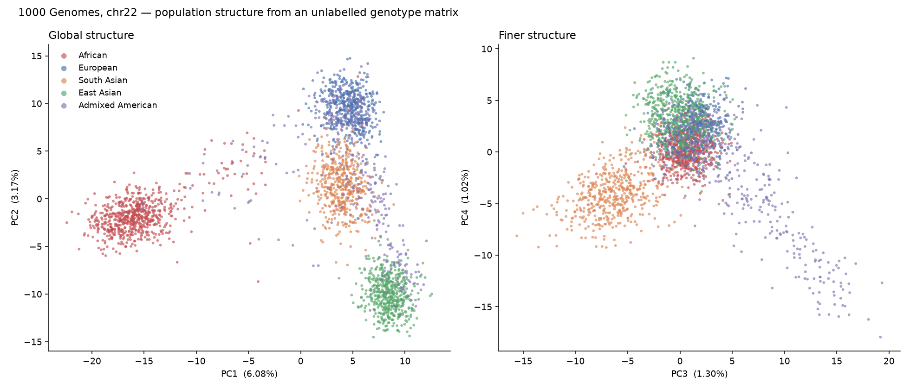

# bio

A generalist's path into genomics, built with Claude Code. Public data only, laptop only.

Five modules, in order — code you run, and a **book** you read alongside it:

## 📖 The book

**[A Generalist's Path into Genomics](https://phreakv6.github.io/genomics/)** — the full theory
behind these modules, written as a 17-chapter book with figures, real program output, and the
repo's code interspersed. Each part of the book maps to one module; each module's `theory.md`
points to its chapters. (Sources live in [`book/`](book/src/SUMMARY.md) and render on GitHub too.)

The point isn't to type the code — it's to understand what every line does and why the field
works that way. The book and the functions map onto each other deliberately.

Written by a software engineer and investor learning this from scratch, so it assumes you can
program and know statistics, and assumes nothing about biology. If you want to learn alongside,
see **[SETUP.md](SETUP.md)** — it's ~55MB of downloads and about 10 minutes of setup.

Corrections are the most valuable contribution: this is a repo written *while* learning, so
open an issue if something here is wrong.

| # | Module | What it teaches | Runs on |
|---|--------|-----------------|---------|
| 01 | `central-dogma/` | DNA → RNA → protein, as string operations | nothing but Python |
| 02 | `rosalind/` | The classic first problems, coded | nothing but Python |
| 03 | `formats/` | FASTA/FASTQ/SAM/BAM/VCF, coordinates, reference builds | conda env `bio` |
| 04 | `pipeline/` | FASTQ → BAM → VCF on GIAB, scored vs a truth set | conda env `bio` |
| 05 | `popgen/` | scikit-allel PCA on 1000 Genomes | conda env `bio` |

## Quick start

Modules 01 and 02 need nothing but Python — no setup, no downloads. Start there.

```bash
python 01-central-dogma/central_dogma.py
python 02-rosalind/rosalind.py && python 02-rosalind/alignment.py
```

For 03–05, create the environment once (**[SETUP.md](SETUP.md)** has the details,
including the Apple Silicon gotcha):

```bash
conda env create -f environment.yml        # prefix with CONDA_SUBDIR=osx-64 on Apple Silicon
conda activate bio

python 03-formats/make_data.py && bash 03-formats/run.sh
python 03-formats/dissect.py && python 03-formats/coordinates.py

bash 04-pipeline/fetch_data.sh && bash 04-pipeline/run.sh
python 04-pipeline/benchmark.py

bash 05-popgen/fetch_data.sh && python 05-popgen/pca.py
```

Each `run.sh` checks its tools first and tells you exactly what to do if the
environment isn't active. Downloaded data lands in per-module `data/`
directories, which are gitignored and safe to delete — the fetch scripts are
re-runnable and skip work already done.

## Results, first pass

**03** — planted rs334 (sickle cell) into simulated reads from the real hg38 HBB
locus; the pipeline recovered exactly one variant, `chr11:5227002 T>A`, genotype
`0/1`, allelic depth 16 ref / 22 alt. Zero false positives.

**04** — real HG002 reads pulled from GIAB's remote 300× BAM, downsampled to 31×,
realigned and called from scratch over `chr11:5,205,000–5,295,000`:

| class | TP | FP | FN | precision | recall | F1 |
|-------|----|----|----|-----------|--------|-----|
| SNP | 160 | 1 | 0 | 0.994 | **1.000** | 0.997 |
| INDEL | 24 | 2 | 3 | 0.923 | 0.889 | 0.906 |
| ALL | 184 | 3 | 3 | 0.984 | 0.984 | 0.984 |

Perfect SNP recall. All six errors sit at just two indel loci, and at both of
them we called something within 10bp of the truth record — the same biological
event written differently. That's the variant-representation problem, not a
detection failure, and it's why `hap.py`/`vcfeval` exist.

**05** — PCA of 2,504 people over 747 LD-pruned markers, unsupervised:

- PC1 isolates African samples (−15.3 vs +4 to +8 for everyone else)
- PC2 separates European (+9.4) from East Asian (−10.0), **South Asian between them at +1.4**


- Within SAS, a clean monotonic cline on PC2/PC3 running Sri Lankan Tamil →
  Bengali → Telugu → Gujarati → Punjabi, i.e. the ANI/ASI ancestry gradient,
  ordered south to north — recovered from nothing but chromosome 22 genotypes.
- Top 10 PCs explain only 14.4% of variance, because most human variation is
  within populations, not between them.

## Ground rules for this project

- Public datasets only for now (1000 Genomes, GIAB, gnomAD). No personal sequencing yet.
- Every result gets checked against a truth set where one exists. The reason GIAB is the
  training sample is precisely that you can score yourself.
