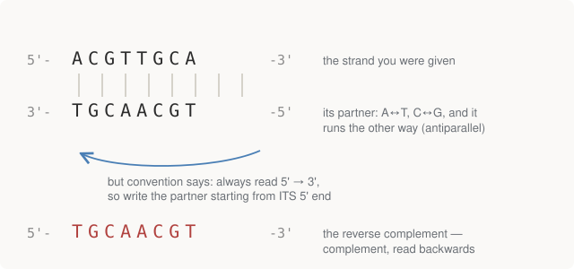

# Chapter 1 — DNA Is a String (Almost)

Genomics looks intimidating from the outside because the vocabulary is dense
and the molecules are unfamiliar. But the core object of the field, from a
programmer's seat, is almost embarrassingly simple: **DNA is a string over a
four-letter alphabet**, and the first several things you'll ever do with it
are string operations you could have written in your first week of
programming. This chapter builds that string model honestly — including the
one place where "it's just a string" is misleading, which happens to be the
single most common source of bugs in the entire field.

## The molecule, in one page

Every cell in your body carries a complete copy of your **genome**: about 3.1
billion characters of DNA, split across 23 pairs of **chromosomes**. Each
chromosome is one enormously long molecule of **DNA**
(deoxyribonucleic acid) — a chain of repeating units called **nucleotides**.

A nucleotide has three parts: a sugar, a phosphate, and a **base**. The sugar
and phosphate are identical from one nucleotide to the next; they link
together into a monotonous backbone, like the spine of a charm bracelet. All
of the information is in which base hangs off each link. There are four:

| Letter | Base | Chemical family |
|--------|----------|-----------------|
| `A` | adenine | purine (large, two-ring) |
| `G` | guanine | purine |
| `C` | cytosine | pyrimidine (small, one-ring) |
| `T` | thymine | pyrimidine |

That's the whole alphabet. A chromosome is, informationally, a string over
`{A, C, G, T}` — chromosome 1 is a string of ~248 million characters. When
you download a reference genome (Chapter 8), what arrives is literally a text
file of these letters.

> **Where you'll also see `N`.** Real sequence files include `N` for "some
> base, we don't know which" — unresolvable stretches like centromeres come
> out as runs of `N`. Any code that maps bases needs to handle it, which is
> why the repo's lookup table includes it.

## Base pairing: the string comes with a checksum

DNA is **double-stranded**: two of these chains wound around each other in
the famous double helix. The two strands are not independent. Each base pairs
with exactly one partner across the rungs of the ladder:

- `A` pairs with `T` (two hydrogen bonds)
- `C` pairs with `G` (three hydrogen bonds)

So if one strand reads `ACGTTGCA`, the opposite strand *must* carry the
complementary letters. The second strand adds no new information — it is
fully determined by the first. That redundancy is not decoration. It is the
copying mechanism (unzip the helix, and each half is a template for
rebuilding the other) and the error-correction mechanism (damage on one
strand can be repaired by reading the partner). Biology shipped RAID-1 about
four billion years before we did.

The pairing rule as code is a dictionary — this is
`central_dogma.py`, and note the `N`:

```python
COMPLEMENT = {"A": "T", "T": "A", "C": "G", "G": "C", "N": "N"}

def complement(seq):
    return "".join(COMPLEMENT[b] for b in seq)
```

The three-bond `C≡G` pair is stronger than the two-bond `A=T` pair, which
gives us the first genuinely useful summary statistic in the field.

## GC content

The **GC content** of a sequence is the fraction of its bases that are `G` or
`C`:

```python
def gc_content(seq):
    """Fraction of G+C. Matters because GC-rich regions bind more tightly, are
    harder to sequence, and GC% is a species/region fingerprint."""
    return (seq.count("G") + seq.count("C")) / len(seq)
```

Why anyone cares:

- **GC-rich DNA is physically tougher to pull apart** (three bonds per rung
  instead of two), which makes it harder to sequence and harder to amplify.
  When a sequencing run has mysterious dead zones, high GC is the first
  suspect.
- **GC% is a fingerprint.** Different species — and different regions within
  one genome — have characteristically different GC content. It's the
  crudest possible feature, and still shows up in everything from
  contamination detection to gene finding.

Counting bases and computing GC content are, respectively, the Rosalind
problems `DNA` and `GC` — Rosalind being the Project Euler of bioinformatics,
which Part II covers properly. They are the "hello world" tier, and the repo
treats them that way: one line each.

## Direction: the part that isn't just a string

Here is where the naive string model needs a patch, and where a real
convention of the field enters.

Each DNA strand has a chemical **polarity** — its two ends are different.
The backbone sugar (deoxyribose) has five carbon atoms, numbered 1′ through
5′ ("one-prime" through "five-prime"; the prime marks distinguish sugar
carbons from atoms in the base). Each new nucleotide gets attached to the 3′
carbon of the previous one, so a strand grows in one direction, and at any
moment it has a **5′ end** and a **3′ end**. Cellular machinery — the
enzymes that copy DNA and transcribe it — only ever moves along a strand in
the 5′→3′ direction. Direction is physically real, not notational.

The convention: **a sequence is always written 5′→3′.** Every file format,
every database, every paper. When you read `ACGTTGCA`, the `A` is the 5′
end.

Now combine that with base pairing. The two strands of the helix run in
*opposite* directions — they are **antiparallel**. So the partner of a
strand is not just its complement: written out in its own 5′→3′ direction,
it's the complement *read backwards*. That operation is the
**reverse complement**, and it is the single most-used operation in all of
bioinformatics:

```python
def reverse_complement(seq):
    """The other strand, written 5'->3' as convention demands.

    This is the most-used operation in the field: roughly half of all sequencer
    reads align to the reverse strand, so every aligner does this constantly.
    """
    return "".join(COMPLEMENT[b] for b in reversed(seq))
```

<figure>
  
  <figcaption>Figure 1-1. The partner strand is determined by base pairing, but it runs the other way — so written in its own 5′→3′ direction it is the complement, reversed. Rosalind problem REVC.</figcaption>
</figure>

Why a programmer should care this early: a DNA fragment coming off a
sequencing machine comes from whichever strand happened to get grabbed —
roughly half your data is the reverse complement of what's in the reference
genome. Every aligner reverse-complements constantly; every "where is this
feature" answer implicitly says which strand it's on. Get strand handling
wrong and nothing crashes — everything downstream is just silently wrong.
This is the first member of a theme that runs through the whole book:
*the genomics failure mode is not the exception, it's the plausible wrong
answer.*

## A real gene fragment

The repo runs all of this on real human sequence: the first 93 bases of
**HBB**, the gene for the beta chain of haemoglobin — the oxygen-carrying
protein that fills your red blood cells. (Chosen because the most famous
mutation in medicine lives in it; that story is Chapter 4's.) Here is the
actual output of `central_dogma.py`, section 1:

```text
1. DNA as a string -- human HBB (beta-globin), first 31 codons
------------------------------------------------------------------------
  sequence   ATGGTGCATCTGACTCCTGAGGAGAAGTCTGCCGTTACTGCCCTGTGGGGCAAGGTGAAC...
  length     93 bp  (31 codons)
  counts     {'A': 17, 'C': 18, 'G': 37, 'T': 21}
  GC content 59.1%

  forward    5'-ATGGTGCATCTGACTCCTGAGGAGAAGTCT...-3'
  complement 3'-TACCACGTAGACTGAGGACTCCTCTTCAGA...-5'
  rev-comp   5'-CCTGCCCAGGGCCTCACCACCAACTTCATC...-3'
  (rev-comp is the OTHER strand written the conventional way)
```

Three things worth noticing in that output:

1. **`bp` means base pairs** — the field's unit of sequence length, used
   even when talking about a single strand. You'll also see kb (thousands),
   Mb (millions), Gb (billions): the human genome is ~3.1 Gb.
2. The complement line is printed 3′→5′ — deliberately, to show it pairs
   letter-for-letter with the forward strand. The rev-comp line is the same
   information rewritten the *legal* way, 5′→3′, and now it starts with what
   used to be the far end.
3. 59.1% GC is on the high side (the genome-wide human average is ~41%) —
   this fragment is from a gene-dense, GC-rich neighbourhood, which is
   itself typical: genes cluster in GC-rich territory.

## What "almost" is doing in this chapter's title

A string plus three amendments is the honest model:

- **There are two strands**, carrying the same information in opposite
  directions — so every position effectively has two readings, and "which
  strand?" is a question you must always be able to answer.
- **Direction is real.** 5′→3′ is not a display convention; it's the
  direction the machinery moves. Reverse ≠ reverse complement ≠ complement,
  and only the reverse complement is another valid strand.
- **The string is annotated by convention, not by content.** Nothing in the
  letters tells you where features start and end — that knowledge lives in
  *other files*, with their own coordinate conventions. This becomes the
  central headache of Part III.

Everything else in Part I — transcription, translation, reading frames,
mutations — builds directly on these three amendments.

## Run it

No environment needed, just Python:

```bash
python 01-central-dogma/central_dogma.py
```

Section 1 of the output is this chapter; the rest of the output belongs to
Chapters 2–4.

## Further reading

- Mukherjee, *The Gene* — the stretch from Watson/Crick through the cracking
  of the genetic code. Read for the story of how this was figured out; it
  makes the facts stick.
- Alberts et al., *Molecular Biology of the Cell*, Ch. 4 (DNA structure).
  Reference, not cover-to-cover.
