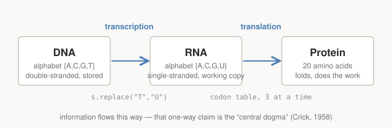

# Chapter 2 — From DNA to Protein

The whole of Part I is one sentence: **DNA → RNA → protein**. Francis Crick
called this the *central dogma* of molecular biology in 1958 — the claim that
sequence information flows from DNA into RNA into protein, and not backwards
from protein. This chapter walks that arrow left to right, and shows that at
the string level both steps are shockingly small: one is a character
substitution, the other is a lookup table.

<figure>
  
  <figcaption>Figure 2-1. The central dogma. DNA is the stored master copy; RNA is a disposable working copy; protein is the machine that gets built from it.</figcaption>
</figure>

## Why three molecules instead of one

Before the mechanics, the design rationale — because the pipeline shape is
not arbitrary:

- **DNA** is the archival copy: double-stranded (so it's error-correctable,
  Chapter 1), chemically stable, kept safe in the cell's nucleus. It does
  essentially nothing except get read and get copied.
- **Protein** does nearly all the actual work of a cell. Proteins are chains
  of **amino acids** that fold up into three-dimensional machines: enzymes
  that run chemistry, structural girders, pumps, sensors, motors. Haemoglobin
  — the protein our running example HBB encodes part of — is a molecular
  cargo container for oxygen.
- **RNA** is the intermediary: a working copy of one gene, single-stranded,
  cheap, disposable. The master blueprint stays in the vault; photocopies of
  single pages go out to the factory floor. (RNA also has jobs of its own —
  some of the photocopies *are* the machine — but the messenger role is the
  one this book needs.)

The two arrows are **transcription** (DNA → RNA) and **translation**
(RNA → protein), and the names are apt: transcription copies text within the
same language; translation converts it to a different one.

## Transcription: a working copy of one gene

Chemically, RNA differs from DNA in two ways: the backbone sugar is ribose
instead of deoxyribose (irrelevant at our level of abstraction), and the base
thymine `T` is replaced by **uracil `U`** — same pairing behaviour, different
molecule. An enzyme called RNA polymerase crawls along one strand of the DNA
5′→3′ and synthesises the RNA copy.

At the string level, that entire biological production is:

```python
def transcribe(dna):
    """Thymine becomes uracil. That is the entire operation at string level."""
    return dna.replace("T", "U")
```

```text
2. Transcription: DNA -> RNA (T becomes U)
------------------------------------------------------------------------
  DNA  ATGGTGCATCTGACTCCTGAGGAGAAGTCT...
  RNA  AUGGUGCAUCUGACUCCUGAGGAGAAGUCU...
```

This is Rosalind problem `RNA`, and it deserves one clarification, because
it looks *too* easy. The polymerase physically reads the **template strand**
and produces its complement — but that product is, by base pairing,
letter-for-letter identical to the *other* strand (the **coding strand**),
with `U` for `T`. Sequence databases store the coding strand, precisely so
that the stored DNA and the resulting RNA read the same. So `replace("T",
"U")` is not a simplification; it's what the convention was designed to make
true. The price of that convenience is that "which strand is stored?" became
a bookkeeping question — one we'll pay for repeatedly in Part III.

## Proteins and the 20-letter alphabet

Proteins are strings too, over an alphabet of 20 **amino acids**. Each has a
one-letter and a three-letter abbreviation, and you need passing familiarity
with both, because variant reports use the three-letter forms (`Glu`, `Val`)
while sequence tools print the one-letter forms (`E`, `V`).

What distinguishes amino acids from each other is their chemical
personality: some are charged and water-loving (glutamate, `E`), some are
greasy and water-avoiding (valine, `V`), some are tiny (glycine, `G`), one is
famously rigid (proline, `P`). A protein chain folds into its working shape
because those personalities attract and repel — greasy residues huddle in
the core away from water, charged ones face outward. This matters to us for
one big reason: **swapping one amino acid for a chemically different one can
change the whole protein's behaviour**, and that is exactly what the famous
mutation in Chapter 4 does.

## The genetic code: a 64-entry lookup table

Translation reads RNA **three bases at a time**. Each triplet is a
**codon**, and a fixed table — the **genetic code** — maps each of the
4³ = 64 possible codons to one of the 20 amino acids, or to "stop". The
repo's version, verbatim:

```python
# The standard genetic code. 64 codons -> 20 amino acids + stop.
# Note how often the third base is irrelevant -- that degeneracy is why many
# DNA mutations are "synonymous" and change nothing about the protein.
CODON_TABLE = {
    "UUU": "F", "UUC": "F", "UUA": "L", "UUG": "L",
    "CUU": "L", "CUC": "L", "CUA": "L", "CUG": "L",
    "AUU": "I", "AUC": "I", "AUA": "I", "AUG": "M",   # AUG = Met = START
    "GUU": "V", "GUC": "V", "GUA": "V", "GUG": "V",
    "UCU": "S", "UCC": "S", "UCA": "S", "UCG": "S",
    "CCU": "P", "CCC": "P", "CCA": "P", "CCG": "P",
    "ACU": "T", "ACC": "T", "ACA": "T", "ACG": "T",
    "GCU": "A", "GCC": "A", "GCA": "A", "GCG": "A",
    "UAU": "Y", "UAC": "Y", "UAA": "*", "UAG": "*",   # * = STOP
    "CAU": "H", "CAC": "H", "CAA": "Q", "CAG": "Q",
    "AAU": "N", "AAC": "N", "AAA": "K", "AAG": "K",
    "GAU": "D", "GAC": "D", "GAA": "E", "GAG": "E",
    "UGU": "C", "UGC": "C", "UGA": "*", "UGG": "W",
    "CGU": "R", "CGC": "R", "CGA": "R", "CGG": "R",
    "AGU": "S", "AGC": "S", "AGA": "R", "AGG": "R",
    "GGU": "G", "GGC": "G", "GGA": "G", "GGG": "G",
}
```

Three structural facts about this table do a lot of work in later chapters:

**It's degenerate.** 64 codons map to only 21 outcomes, so most amino acids
have several codons — usually differing in the **third position**. Look at
any row: `GUU/GUC/GUA/GUG` are all valine. A consequence you'll meet
constantly in variant analysis: a DNA change in a codon's third position
often changes nothing about the protein. The code has slack, and the slack
is unevenly distributed — third positions are loose, first and second
positions are load-bearing.

**`AUG` is both an amino acid and the start signal.** It codes methionine
(`M`), and it's also where translation begins — which is why every
freshly-made protein starts with `M`, and why "find the `AUG`" is the first
step of gene-finding in the next chapter.

**Three codons mean stop.** `UAA`, `UAG`, `UGA` code for no amino acid;
they terminate translation. In printouts they appear as `*`.

> **Why is the table universal?** With minor exceptions, this exact mapping
> is shared by bacteria, oak trees, and you — evidence that all current life
> inherited it from a single ancestor, and the reason genetic engineering
> works at all: a human gene pasted into a bacterium translates to the same
> protein.

## Translation in code

```python
def translate(rna, stop_at_stop=True):
    """Read three bases at a time through the codon table."""
    protein = []
    for i in range(0, len(rna) - len(rna) % 3, 3):
        aa = CODON_TABLE[rna[i:i + 3]]
        if aa == "*" and stop_at_stop:
            break
        protein.append(aa)
    return "".join(protein)
```

Two details of this implementation are deliberate and will matter:

- The loop bound `len(rna) - len(rna) % 3` drops a trailing 1–2 bases that
  can't form a codon. That innocuous-looking clamp is the reason reading
  frames have different lengths — Chapter 3 makes a whole point of it.
- `stop_at_stop` exists because sometimes you want honest biology (stop at
  the stop codon) and sometimes you want to see everything, stops included —
  which is how you *find* genes in unknown sequence.

Run on our HBB fragment (Rosalind problem `PROT`), with the output arranged
so codons line up over their amino acids:

```text
3. Translation: RNA -> protein (three bases at a time)
------------------------------------------------------------------------
  AUG GUG CAU CUG ACU CCU GAG GAG AAG UCU GCC GUU
    M   V   H   L   T   P   E   E   K   S   A   V
  ACU GCC CUG UGG GGC AAG GUG AAC GUG GAU GAA GUU
    T   A   L   W   G   K   V   N   V   D   E   V

  protein  MVHLTPEEKSAVTALWGKVNVDEVGGEALGR
  ^ that is the real N-terminus of human haemoglobin beta chain
```

That `protein` line is not a toy result. `MVHLTPEEK...` is the real N-terminus —
the actual first residues — of the beta chain of human haemoglobin, the
protein in your blood right now. Thirty lines of Python, a dictionary, and a
public gene sequence reproduce it exactly. That's the central dogma made
operational.

## About that word "dogma"

Crick later admitted "dogma" was a poor word choice — he thought it meant
"a bold hypothesis". The claim itself has known exceptions worth one
paragraph, because you'll meet one of them in this book's data sources:
**retroviruses** (HIV is one) carry their genome as RNA and copy it *back*
into DNA with an enzyme called reverse transcriptase — information flowing
RNA → DNA. The arrow that has never been observed to reverse is
protein → nucleic acid. For everything this book does, the forward reading
holds: DNA → RNA → protein.

What the dogma glosses over is *which* DNA gets transcribed, *when*, and
*where the boundaries are*. Those questions — genes, frames, and the
annotation that records them — are the next chapter.

## Run it

```bash
python 01-central-dogma/central_dogma.py
```

Sections 2 and 3 of the output are this chapter.

## Further reading

- Mukherjee, *The Gene* — the race to crack the code (Nirenberg, Khorana) is
  one of the best stretches of the book.
- Alberts et al., *Molecular Biology of the Cell*, Ch. 6 — "How Cells Read
  the Genome: From DNA to Protein". This is the central dogma proper, with
  the molecular machinery this chapter abstracted away.
