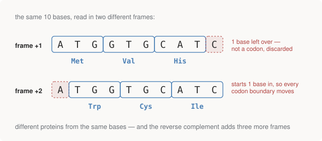
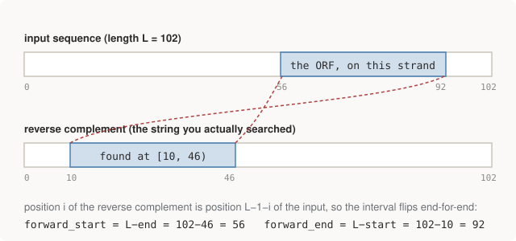

# Chapter 3 — Reading Frames and Open Reading Frames

Chapter 2 translated a sequence that had been politely trimmed to start
exactly at the start codon. Real sequence never arrives like that. You get a
stretch of DNA — from a sequencer, from a database slice — and nothing in the
letters tells you where, or whether, a protein-coding region begins. This
chapter is about how you look: **reading frames**, and the classic
gene-hunting construct built on them, the **open reading frame (ORF)**.

## Reading frames: where you start changes everything

Translation reads in non-overlapping triplets, so the result depends
entirely on where you start. Begin at position 0, 1, or 2 of a sequence and
you get three completely different codon groupings — three different
proteins. These are the three forward **reading frames**, conventionally
called +1, +2, +3.

<figure>
  
  <figcaption>Figure 3-1. Shifting the start by one base moves every codon boundary, so the same letters spell entirely different proteins. Note the shaded leftover bases — a frame that starts 1 base in has 1 base too few at the end to form a codon.</figcaption>
</figure>

And because DNA is double-stranded (Chapter 1), the reverse complement has
three frames of its own: −1, −2, −3. **Any stretch of DNA has six reading
frames**, and when you don't know where a gene is, you translate all six:

```python
def six_frame_translation(dna):
    """Three frames forward, three on the reverse complement.

    When you don't know where a gene starts, this is how you look.
    """
    frames = {}
    for offset in range(3):
        frames[f"+{offset + 1}"] = translate(transcribe(dna[offset:]), stop_at_stop=False)
    rc = reverse_complement(dna)
    for offset in range(3):
        frames[f"-{offset + 1}"] = translate(transcribe(rc[offset:]), stop_at_stop=False)
    return frames
```

Here it is on the 93bp HBB fragment — real output, and worth reading
closely:

```text
4. Reading frames -- where you start changes everything
------------------------------------------------------------------------
  frame +1  MVHLTPEEKSAVTALWGKVNVDEVGGEALGR  31 aa
  frame +2  WCI*LLRRSLPLLPCGAR*TWMKLVVRPWA  30 aa  (+2 bases left over, discarded)
  frame +3  GASDS*GEVCRYCPVGQGERG*SWW*GPGQ  30 aa  (+1 base left over, discarded)
  frame -1  PAQGLTTNFIHVHLAPQGSNGRLLLRSQMHH  31 aa
  frame -2  LPRASPPTSSTFTLPHRAVTADFSSGVRCT  30 aa  (+2 bases left over, discarded)
  frame -3  CPGPHHQLHPRSPCPTGQ*RQTSPQESDAP  30 aa  (+1 base left over, discarded)

  only frame +1 is the real one; the rest are riddled with stops (*)
```

Two practical gotchas live in that output, and both have bitten real code:

**Frames have different lengths.** A 93bp sequence gives 31, 30, and 30
residues in frames +1/+2/+3 — *not* 31 three times. Starting 1 or 2 bases in
leaves a trailing 1–2 bases that can't form a codon; `translate()` discards
them via its `len(rna) - len(rna) % 3` loop bound. Two bases are not a codon
and nothing can be said about them. (An earlier version of this repo's
display clipped all frames to the same width, hiding exactly this — the
prose said one thing, the output another. The bug survived until someone
asked "wouldn't the lengths differ?" — which is why the output now prints
the lengths and the leftovers explicitly.)

**The ± frame numbers are not aligned columns.** Frame −1 starts at offset
0 of the *reverse complement* — which is the far end of the input. Index 5
in frame +1 and index 5 in frame −1 sit at opposite ends of the molecule.
The symmetric naming makes the six frames look like paired lanes; they are
six independent readings. This becomes a real coordinate bug the moment you
find something in a minus-strand frame and need to say where it is — which
is exactly what ORF finding has to do, below.

## What an ORF actually is

An **open reading frame** is a stretch of sequence that *could* be a
protein-coding region: in some frame, a start codon (`AUG`), followed by a
run of codons containing no stop, terminated by a stop codon (`UAA`, `UAG`,
or `UGA`). "Open" means open for translation — no stop closing it off
prematurely.

Why long ORFs are evidence of a gene, in one back-of-envelope: 3 of the 64
codons are stops, so in *random* sequence you expect a stop about every
64/3 ≈ 21 codons. A frame that runs hundreds of codons without a stop is
wildly unlikely by chance — something (natural selection, specifically) has
been keeping stop codons out of that frame, and that something is the fact
that the region encodes a working protein. Look again at the six-frame
output above: the wrong frames are riddled with `*` at roughly the expected
rate, while frame +1 has none in 31 codons.

So the naive gene-finding recipe is: translate all six frames, find
`AUG...stop` runs, and keep the long ones. The repo implements exactly
that:

```python
def find_orfs(dna, min_aa=20):
    """Open reading frames: AUG ... stop, in any of the six frames.

    Coordinates are always reported against the ORIGINAL forward sequence,
    0-based half-open [start, end) like a BED interval, with `end` including
    the stop codon. ...
    """
    L = len(dna)
    orfs = []
    for strand, strand_seq in (("+", dna), ("-", reverse_complement(dna))):
        rna = transcribe(strand_seq)
        for start in range(len(rna) - 2):
            if rna[start:start + 3] != "AUG":
                continue
            peptide = translate(rna[start:], stop_at_stop=True)
            # translate() stops before the stop codon, so the codon that
            # follows the peptide must itself be a stop for this to be a
            # complete ORF rather than one running off the end of the input.
            stop_at = start + 3 * len(peptide)
            if rna[stop_at:stop_at + 3] not in STOPS:
                continue
            if len(peptide) < min_aa:
                continue

            end = stop_at + 3                      # include the stop codon
            if strand == "+":
                fwd_start, fwd_end = start, end
            else:
                # index i of the reverse complement is index L-1-i of the
                # forward sequence, so the interval flips end-for-end.
                fwd_start, fwd_end = L - end, L - start

            orfs.append({
                "strand": strand,
                "start": fwd_start,                # 0-based, on the input seq
                "end": fwd_end,                    # half-open, includes stop
                "peptide": peptide,
            })
    return sorted(orfs, key=lambda o: (o["start"], o["strand"]))
```

The `min_aa` threshold is the "keep the long ones" filter — it's what
separates "statistically interesting" from the thousands of tiny
`AUG`-something-stop runs any sequence contains by chance.

## First attempt: it finds nothing, and that's the lesson

Run on the HBB fragment:

```text
6. ORF finding (naive)
------------------------------------------------------------------------
  Nothing found in HBB_CDS: this fragment is cut mid-gene, so the
  real ORF runs off the end without ever reaching a stop codon.
  Realistic -- genes do not come pre-trimmed, and introns make
  naive ORF finding fail outright on real genomic DNA.
```

The fragment starts with a perfectly good `AUG` and translates beautifully —
but it's the first 93 bases of a much longer coding sequence, so no stop
codon is ever reached, and a complete ORF requires one. Genes do not come
pre-trimmed to your window. Any window-based analysis has edge effects;
here's the genomics version.

## A sequence built to be searched

To show the finder working, the repo constructs a 102bp sequence with two
genes planted in it — **one on each strand**. The construction is worth
reading because it exercises everything from Chapters 1–2:

```python
# Each is 12 codons: ATG + 10 more + a stop, giving an 11-residue peptide.
_ORF_FWD = "ATG" + "GCTTTAGGTCATAAGCCTTGGGAAGATTTC" + "TAA"
_ORF_REV = "ATG" + "AAACGTGTTTGGCAAGACTTAATTCCGAGT" + "TGA"

# _ORF_REV is written as the gene READS -- 5'->3' along the minus strand. To
# plant it we need what the PLUS strand must say at that location, which is
# its reverse complement. This is the same conversion find_orfs() has to undo.
DEMO = ("CCTTACGAGT"
        + _ORF_FWD
        + "GGATCCTTAA"
        + reverse_complement(_ORF_REV)
        + "TTAGGCCATA")
```

Note what the comment is careful about: the two planted genes are *different
genes at different positions*, not reverse complements of each other.
Bacterial genomes really do look like this — genes densely packed on both
strands with short gaps. (A pair that *were* mutual reverse complements
would be one stretch of DNA encoding two proteins read in opposite
directions — real, but essentially confined to viruses under extreme
genome-size pressure, because every base then has to satisfy two coding
constraints at once.)

The finder reports both, with coordinates on the forward sequence:

```text
  strand   start   end   len   peptide
  +           10    46   36nt   MALGHKPWEDF*
  -           56    92   36nt   MKRVWQDLIPS*
```

## The minus-strand coordinate trap

The minus-strand ORF was *found* at offset 10 of the reverse-complemented
string — but it's *reported* at [56, 92) of the input. That mapping is the
trap this chapter has been building toward: position `i` of the reverse
complement is position `L−1−i` of the original, so an interval flips
end-for-end, and the searched-string offsets must be mapped back with
`L − end` before they mean anything.

<figure>
  
  <figcaption>Figure 3-2. A hit at [10, 46) in the reverse-complemented search string is really at [L−46, L−10) = [56, 92) on the input. Report the raw offset and the feature silently lands at the wrong end.</figcaption>
</figure>

Skip the mapping and nothing crashes — the feature is simply reported at the
wrong end of the sequence, with plausible-looking numbers. It's Chapter 1's
warning in its first concrete form, and a preview of Part III, where
coordinate conventions become a whole chapter.

The code *proves* its mapping is right rather than asserting it: slice the
original at the reported coordinates, reverse-complement if the hit was on
the minus strand, translate, and check the peptide comes back:

```text
    strand +  DEMO[10:46]            -> MALGHKPWEDF   [OK]
    strand -  DEMO[56:92] -> revcomp -> MKRVWQDLIPS   [OK]
```

That round-trip-and-assert pattern — *compute the check instead of trusting
the arithmetic* — is a habit the rest of the repo leans on heavily.

## Why this fails on human DNA: genes are interrupted

Naive ORF finding works on bacteria. On human sequence it fails for a
structural reason that changes everything downstream:

Human genes are **interrupted**. The coding stretches — **exons** —
alternate with non-coding stretches called **introns**. The cell transcribes
the whole thing, then cuts out the introns and stitches the exons together
(**splicing**) before translation. An intron dropped into the middle of a
coding sequence shatters the reading frame as it sits in the genome: the
codons of the real protein are split across pieces that may be thousands of
bases apart. A six-frame scan of raw genomic DNA can't see any of that.

Worse — or better, depending on your taste — the same gene can be spliced
multiple ways (**alternative splicing**), producing different proteins from
one stretch of DNA. And only ~1–2% of the human genome codes for protein at
all; the rest is regulatory sequence, structural elements, repeats, and
things still poorly understood. ("Junk DNA" was a bad name for "we hadn't
read it yet.")

The consequence: for the human genome, *where the genes are* is not derivable
from the sequence by inspection. It's curated knowledge, stored in separate
**annotation** files (GFF/GTF — Chapter 12) that record where each gene's
exons sit and which strand it reads from. This is the first place genomics
stops being a string-algorithms problem and becomes a data-integration
problem — and the first place your engineering instincts about keeping
data and metadata in sync start to pay.

## Run it

```bash
python 01-central-dogma/central_dogma.py
```

Sections 4 and 6 of the output are this chapter.

## Further reading

- Alberts et al., *Molecular Biology of the Cell*, Ch. 6 — the splicing
  machinery this chapter waved at.
- Rosalind's `ORF` problem is this chapter as an exercise, if you want to
  write your own before reading the repo's.
