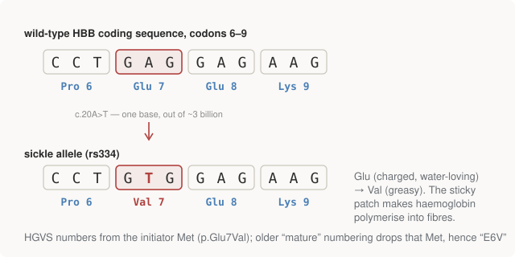

# Chapter 4 — When One Base Changes

Everything so far treated sequence as fixed. But the interesting questions in
genomics — medical, evolutionary, forensic — are almost all about
*differences*: between you and a reference, between a tumour and the tissue
around it, between populations. This chapter builds the vocabulary of
variation, then spends most of its time on a single celebrated base: the
mutation that causes sickle cell disease, which manages to teach variant
classification, two numbering standards, and a deep point about annotation,
all in one `A`.

## The taxonomy of variation

Variants sort by *size and shape* first:

- **SNV** — single nucleotide variant: one base differs. An `A` where the
  reference has a `G`. The overwhelming majority of variants. You'll also
  see **SNP** (single nucleotide *polymorphism*), historically reserved for
  single-base variants common in a population; in practice the terms blur,
  and this book follows the field's loose usage.
- **Indel** — a small **in**sertion or **del**etion, conventionally up to
  ~50bp. Indels in coding sequence have a property SNVs don't: if the length
  isn't a multiple of 3, every codon boundary downstream shifts — a
  **frameshift**. After Chapter 3 you can see why that's usually
  catastrophic: the rest of the protein is translated in the wrong frame,
  producing garbage until a chance stop codon.
- **Structural variant (SV)** — the large stuff, typically >50bp: big
  deletions, duplications, inversions, translocations. Hardest to detect
  with short sequencing reads (a 150bp read can't span a 10kb event), which
  is a major reason long-read technologies (PacBio, Nanopore) exist.

And by *zygosity* — you carry two copies of each chromosome (one per
parent), so at any position you are:

- **homozygous** — both copies agree, or
- **heterozygous** — the copies differ; you carry two **alleles**, meaning
  two versions of the sequence at that position.

Hold onto that distinction: in Part III it becomes literally one field of a
file format — a VCF genotype of `1/1` versus `0/1` — and in Part IV,
distinguishing a true heterozygote from sequencing noise turns out to be the
central statistical problem of variant calling.

> **"Variant" is always relative.** A variant is a difference *from a
> reference genome* — an agreed-upon consensus sequence everyone reports
> against. The reference is not "a normal person's genome"; it's a mosaic
> assembled from multiple donors, with its own errors and biases. No file
> in this field says "this genome is X"; every file says "this genome
> differs from the reference by X". That framing — the genome as a diff —
> is load-bearing for everything in Parts III–V.

## What a coding SNV does to the protein

For an SNV inside a coding sequence, Chapter 2's codon table decides the
consequence, and the field has names for each case:

| Consequence | What happened | Chapter 2 reason |
|---|---|---|
| **synonymous** | amino acid unchanged | degeneracy — often a 3rd-position change |
| **missense** | one amino acid swapped for another | codon now maps to a different residue |
| **nonsense** | codon became a stop — protein truncated | `UAA`/`UAG`/`UGA` created |
| **stop-lost** | a stop codon became an amino acid — translation runs on | stop destroyed |
| **start-lost** | the initiator `AUG` destroyed — translation can't begin here | start codon required |

Most of variant interpretation *begins* with sorting mutations into these
buckets — it's the first filter in every clinical pipeline, cheap to compute
and enormously informative. The repo implements it in `classify_snv()`,
which applies the change, translates both versions, and compares:

```python
def classify_snv(cds, pos, ref, alt, cds_offset=0):
    mutant = apply_snv(cds, pos, ref, alt)
    wt_protein = translate(transcribe(cds[cds_offset:]), stop_at_stop=False)
    mut_protein = translate(transcribe(mutant[cds_offset:]), stop_at_stop=False)

    codon_index = (pos - cds_offset) // 3            # 0-based
    wt_aa, mut_aa = wt_protein[codon_index], mut_protein[codon_index]

    if wt_aa == mut_aa:
        kind = "synonymous"
    elif codon_index == 0:
        kind = "start-lost"
    elif wt_aa == "*":
        kind = "stop-lost"                           # translation runs on
    elif mut_aa == "*":
        kind = "nonsense"                            # premature stop
    else:
        kind = "missense"
    ...
```

One small function it calls deserves its own spotlight:

```python
def apply_snv(seq, zero_based_pos, ref, alt):
    """Apply a single-nucleotide change, asserting the reference matches.

    That assertion is not paranoia -- 'my REF doesn't match the reference'
    is the classic symptom of a genome-build mismatch (hg19 vs hg38).
    """
    assert seq[zero_based_pos] == ref, ...
```

Asserting that the reference base is what you expected before applying a
change is a field-wide defensive idiom, and Chapter 11 explains the specific
disaster (two incompatible versions of the human reference genome) that
makes it non-negotiable.

## The case study: one base, one disease

**Sickle cell disease** is the canonical example, and HBB — the gene this
book has been translating since Chapter 1 — is where it lives. A single
`A→T` at position 20 of the coding sequence (the variant catalogued as
**rs334**) changes codon 7 from `GAG` to `GTG`: glutamate becomes valine.

<figure>
  
  <figcaption>Figure 4-1. The sickle mutation: one base changes, codon 7's amino acid changes, and the protein's surface chemistry changes. Every other codon is untouched.</figcaption>
</figure>

The repo's output:

```text
5. A real mutation: sickle cell disease
------------------------------------------------------------------------
  change     c.20A>T   (GAG -> GTG)
  effect     missense   p.Glu7Val
  wild type  MVHLTPEEKSAVTALW
  mutant     MVHLTPVEKSAVTALW
                   ^ Glu (charged, water-loving) -> Val (greasy)
```

Why this particular swap is devastating: glutamate is charged and sits
happily on the protein's water-facing surface. Valine is hydrophobic —
greasy. The mutation puts a greasy patch on the *outside* of haemoglobin,
and greasy patches in water find each other: deoxygenated mutant haemoglobin
molecules stick together and polymerise into stiff fibres that deform the
red blood cell into the crescent — sickle — shape that gives the disease its
name. Sickled cells jam capillaries and die early; the result is anaemia and
episodes of severe pain. One base out of three billion.

> **Why hasn't selection removed it?** Carriers — heterozygotes, one sickle
> allele and one normal — are substantially protected against severe
> malaria. Where malaria is endemic, the allele is worth keeping at the
> population level despite its cost to homozygotes. This *heterozygote
> advantage* is why rs334 remains common in populations from historically
> malarial regions, and it's the textbook example of balancing selection.

For contrast, the very same codon, one position over:

```text
  change     c.21G>A   (GAG -> GAA)   effect: synonymous  p.Glu7Glu
```

Same codon, different position, zero consequence — `GAA` also codes
glutamate. That asymmetry between position 20 and position 21 is Chapter 2's
degeneracy made physical: the code's slack is real slack, and the first
question about any coding variant is whether it landed on a load-bearing
base.

## Naming variants: HGVS, and the off-by-one everyone hits

Variant names in the output like `c.20A>T` and `p.Glu7Val` follow **HGVS**
nomenclature — the Human Genome Variation Society standard. The prefixes
matter: `g.` for genomic coordinates, `c.` for positions in the coding DNA
sequence (1-based, counting from the `A` of the start `AUG`), `p.` for
protein residues. `c.20A>T` reads: at coding position 20, `A` becomes `T`.

Now the trap. HGVS numbers protein residues **from the initiator
methionine, which is residue 1**. But there's an older convention —
**mature-protein numbering** — from the era when protein chemists sequenced
finished proteins directly: in most proteins the initiator Met is snipped
off during maturation, so the older literature counts from the *next*
residue, and every number is one lower. The sickle variant is therefore:

```text
  Two names for this variant, both correct:
    p.Glu7Val    HGVS -- counts from the initiator Met, which
                 is residue 1. This is what ClinVar records.
    p.Glu6Val    mature numbering -- counts after that Met is
                 cleaved off the finished protein. The historical
                 literature name, and why everyone says 'E6V'.
```

Every textbook says "E6V"; ClinVar (the NIH's clinical variant database)
says `p.Glu7Val`. Same variant, both names correct under their own
convention, endless confusion at the boundary. This repo itself shipped the
error once — a display labelled `p.Glu6Val` as HGVS — and it's worth
internalising as a pattern: **off-by-one disagreements between conventions
are this field's signature bug**, and Part III is substantially about their
coordinate-system cousins.

## "The same codon" is a claim about the annotation

Here is the chapter's deepest point, and it's one the naive picture misses
entirely. Saying "rs334 is in codon 7" quietly assumes you know where the
coding sequence starts. Shift that assumed start by one base and every codon
boundary moves — so the *same physical base* lands in a different codon, at
a different position within it, and gets a different verdict. The repo runs
exactly this experiment — the same `A→T`, read under three assumed frames:

```text
  CDS starts    codon  pos    mutant  effect      change
  index 0         GAG    2 -> GTG     missense    Glu -> Val
  index 1         AGG    1 -> TGG     missense    Arg -> Trp
  index 2         TGA    3 -> TGT     stop-lost   Ter -> Cys
```

Not a milder or stronger version of one finding — three *different*
findings, one of which isn't even a missense but a lost stop codon.

In the cell, the frame is not a free choice: the ribosome starts at one
particular `AUG`, splicing joins the exons one particular way, and there is
a single true frame per transcript. What varies is our *knowledge* of it —
the **annotation** — and that knowledge is genuinely plural:

- **One gene, many transcripts.** Alternative splicing (Chapter 3) puts the
  same base into different codons in different isoforms. Annotation tools
  like VEP and SnpEff therefore report one consequence *per transcript* —
  a variant that's missense in one isoform and synonymous in another is
  routine, and both reports are true.
- **So a bare `c.20A>T` is not interpretable.** Full HGVS carries the
  transcript and its version: `NM_000518.5:c.20A>T`. The short form works
  in this book only because HBB is simple.
- **MANE Select** exists for exactly this reason — NCBI and EMBL-EBI
  agreeing on one canonical transcript per gene, so clinical labs stop
  talking past each other.
- **Annotations drift between releases**, so the same variant can change
  consequence between database versions — a real, documented source of
  clinical discordance.

The moral extends the one from Chapter 3: the sequence is the easy part.
The interpretive layer — where the genes are, where the frames start, which
transcript you mean — lives outside the sequence, versioned and fallible,
and most practical genomics bugs are failures to keep the two in sync.

## Where this leaves us

Part I is complete: you can now read DNA as a string, run it forward to
protein, search it in six frames, and classify what a one-base change does —
all with code you've seen in full. What Part I *couldn't* do is compare two
sequences that differ by more than substitutions: the moment an indel enters
(and real data is full of them), position-by-position comparison shatters.
Fixing that properly is dynamic programming — **alignment** — and it's the
subject of Part II.

## Run it

```bash
python 01-central-dogma/central_dogma.py
```

Sections 5 and 5b of the output are this chapter.

## Further reading

- Mukherjee, *The Gene* — the sickle cell story, told properly.
- The [ClinVar entry for rs334](https://www.ncbi.nlm.nih.gov/clinvar/variation/15333/) —
  see a real clinical variant record with your now-functional HGVS literacy.
- Alberts et al., *Molecular Biology of the Cell*, Ch. 7 (regulation) for
  how much machinery sits around "which transcript gets made".
