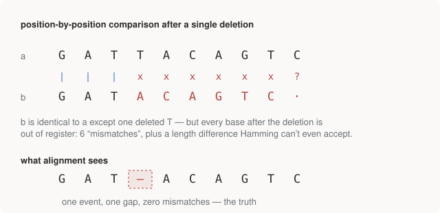

# Chapter 5 — Distance Before Alignment

Part II is about the algorithmic core of the whole field: comparing
sequences. This chapter does comparison the *cheap* way — position by
position — and takes it seriously enough to see exactly where it breaks.
The break, when it comes, is structural, and it motivates everything in
Chapters 6 and 7.

The chapter is organised around problems from [Rosalind](https://rosalind.info)
— a problem-by-problem introduction to bioinformatics in the style of
Project Euler. The first dozen Rosalind problems walk through the central
dogma as code; you effectively solved those in Part I. The ones that remain
introduce something new each:

| Code | Problem | The real point |
|------|---------|----------------|
| `GC` | Highest GC content in a FASTA | Your first parser. FASTA is everywhere |
| `HAMM` | Hamming distance | Counting mismatches = the crudest possible alignment score |
| `SUBS` | Find motif occurrences | Overlapping matches — `str.find` in a loop, not regex |
| `CONS` | Consensus & profile matrix | Position weight matrices — the basis of motif finding |

## GC: your first file format

The `GC` problem hands you sequences in **FASTA** format and asks which has
the highest GC content (Chapter 1's statistic). The format itself is
Chapter 8's subject; what matters here is the shape of the first real
parsing task in the field: a `>` header line, then sequence wrapped across
multiple lines until the next `>`. The wrapping means you cannot treat lines
as records — you accumulate until the next header:

```python
def parse_fasta(text):
    """Yield (header, sequence) pairs. Handles multi-line sequences."""
    header, chunks = None, []
    for line in text.strip().splitlines():
        line = line.strip()
        if not line:
            continue
        if line.startswith(">"):
            if header is not None:
                yield header, "".join(chunks)
            header, chunks = line[1:], []
        else:
            chunks.append(line)
    if header is not None:
        yield header, "".join(chunks)
```

```text
GC  -- parse FASTA, find the highest-GC sequence
------------------------------------------------------------------------
  Rosalind_6404   80 bp   GC 53.7500%
  Rosalind_5959   84 bp   GC 53.5714%
  Rosalind_0808   87 bp   GC 60.9195%
  -> highest GC: Rosalind_0808
```

Note that `rosalind.py` imports `gc_content`, `translate`, and
`reverse_complement` straight from module 01's code — the repo reuses its
own primitives across modules deliberately, the way the chapters of this
book reuse each other's vocabulary.

## HAMM: comparison the cheap way

The **Hamming distance** between two equal-length strings is the number of
positions at which they differ. That's the entire definition — `HAMM` is
the Rosalind problem that asks for it, and the name you'll see it under
throughout bioinformatics:

```python
def hamming(a, b):
    """Mismatch count. Requires equal length and permits no gaps -- which is
    exactly the limitation that forces us into alignment (see alignment.py)."""
    if len(a) != len(b):
        raise ValueError("Hamming distance needs equal-length strings")
    return sum(x != y for x, y in zip(a, b))
```

```text
HAMM -- counting mismatches
------------------------------------------------------------------------
  GAGCCTACTAACGGGAT
  x|x|x||x|x||||xx|   x = mismatch, | = match
  CATCGTAATGACGGCCT
  01234567890123456   position

  distance = 7   (7 mismatches + 10 matches = 17 positions)
  mismatches at [0, 2, 4, 7, 9, 14, 15]
```

Biologically, Hamming distance is a mutation counter: if two sequences
descend from a common ancestor and only ever suffered substitutions, the
Hamming distance is the number of visible point mutations between them. It
is also, though nobody says it this way at first, *the crudest possible
alignment score* — an alignment where the correspondence between positions
is fixed in advance to be the identity.

And that assumption is exactly the weak joint.

## Where Hamming shatters

Biology does not only substitute; it inserts and deletes (Chapter 4's
indels — and they are everywhere: replication slippage produces them
constantly, especially in repetitive sequence). Delete a single base and
watch what position-by-position comparison does:

<figure>
  
  <figcaption>Figure 5-1. One deleted base throws every downstream position out of register: sequences that differ by one biological event look almost maximally different to Hamming distance. An alignment that can propose a gap sees the truth — one event, everything else identical.</figcaption>
</figure>

The failure is not that the distance is a bit off. It's that a *single*
event makes two nearly-identical sequences look almost unrelated — the
metric's error is unbounded in the size of the true difference. Any method
built on fixed positional correspondence inherits this. What's needed is a
method that treats the correspondence itself as the unknown — that is
allowed to *propose gaps* — and that is precisely what alignment is.
Chapter 6 builds it. The module's own output says it compactly:

```text
  Note what this CANNOT do: if b had one base deleted, every
  position after it would count as a mismatch. That failure is
  the entire motivation for alignment.
```

## SUBS: finding a motif, overlaps included

A **motif** is a short recurring pattern — a regulator's binding site, a
repeated unit, a landmark you're searching for. `SUBS` asks for every
position where a motif occurs in a longer sequence, and it contains one
genuinely instructive trap:

```python
def find_motif(seq, motif):
    """All 1-based start positions, INCLUDING overlapping matches."""
    positions, start = [], 0
    while True:
        i = seq.find(motif, start)
        if i == -1:
            return positions
        positions.append(i + 1)   # Rosalind and genomics are 1-based
        start = i + 1
```

```text
SUBS -- motif occurrences, overlaps included
------------------------------------------------------------------------
  sequence GATATATGCATATACTT
  motif    ATAT
  1-based positions: [2, 4, 10]
            ^ ^     ^
  positions 2 and 4 overlap -- a regex findall would miss one.
```

Two field conventions hiding in eight lines:

- **Overlapping matches count.** `ATAT` occurs at positions 2 *and* 4 —
  the occurrences share bases. A regex `findall` consumes what it matches
  and would silently report only one of them. Overlaps are not a pedantic
  edge case in DNA: repeated and self-similar sequence is everywhere
  (Chapter 15 will show it's where variant callers go to die), and tandem
  repeats are overlapping matches *by construction*. Hence the
  `find`-then-advance-by-one loop.
- **Positions are reported 1-based.** Rosalind, and most human-facing
  genomics, counts from 1. Python counts from 0. That `i + 1` is the first
  of many such conversions in this book, and Chapter 11 is entirely about
  what happens when they're done wrong.

## CONS: from strings to a probabilistic motif

The last problem quietly introduces the most statistical idea of the group.
Given several equal-length sequences, build the **profile matrix** — for
each column, count how many sequences have `A`, `C`, `G`, `T` — and read
off the **consensus**, the most common base per column:

```python
def profile_matrix(seqs):
    """Count each base at each column. This is a position weight matrix, the
    foundation of motif finding -- how you describe 'a transcription factor
    binds roughly TATAAA' as a probabilistic object rather than a fixed string.
    """
    n = len(seqs[0])
    profile = {b: [0] * n for b in "ACGT"}
    for seq in seqs:
        for i, base in enumerate(seq):
            if base in profile:
                profile[base][i] += 1
    return profile
```

```text
CONS -- profile matrix and consensus
------------------------------------------------------------------------
    ATCCAGCT
    GGGCAACT
    ATGGATCT
    AAGCAACC
    TTGGAACT
    ATGCCATT
    ATGGCACT

  A: 5 1 0 0 5 5 0 0
  C: 0 0 1 4 2 0 6 1
  G: 1 1 6 3 0 1 0 0
  T: 1 5 0 0 0 1 1 6
  consensus: ATGCAACT
```

The consensus string is the least interesting output. The interesting
object is the matrix itself: **each column is a distribution, not a
letter**. Column 1 says "A usually, occasionally G or T". Normalise the
counts to frequencies, take logs against a background rate, and you have a
**position weight matrix (PWM)** — the standard model for fuzzy biological
patterns. A transcription factor doesn't bind exactly `TATAAA`; it binds a
*distribution* around it, tolerating some positions and insisting on
others. Splice sites, promoter elements, protein domains — the field's
motif models are all elaborations of this little matrix of counts. If you
come from markets: it's the step from "the pattern is this string" to "the
pattern is this factor exposure profile", and it's the same modelling move.

## Where we stand

Four problems, four durable tools: a parser, a distance, a search loop, a
probabilistic pattern. And one structural failure — Hamming's collapse in
the presence of indels — that the next chapter repairs with the single most
important algorithm in the field.

## Run it

```bash
python 02-rosalind/rosalind.py
```

## Further reading

- [rosalind.info](https://rosalind.info) — do a few beyond these; the
  "Bioinformatics Stronghold" track escalates nicely.
- Compeau & Pevzner, *Bioinformatics Algorithms* — Chapter 2 treats motif
  finding (this chapter's `CONS` grown up) at full depth.
