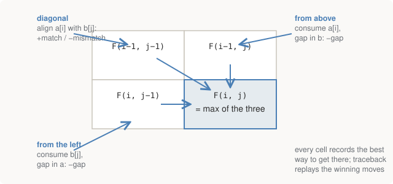

# Chapter 6 — Alignment

This is the most important algorithm in the book. **Sequence alignment** is
the machinery underneath read mapping, variant calling, database search,
protein comparison — essentially every time two pieces of biological
sequence meet, this algorithm (or a descendant tuned for speed) is what
introduces them. The good news for a programmer: it's dynamic programming
you have almost certainly seen before, as edit distance, wearing a
biology-flavoured scoring function.

## The problem, stated properly

Given two sequences, find the correspondence between their characters that
maximises a score, where:

- aligning two identical characters earns points (a **match**),
- aligning two different characters loses points (a **mismatch** — a
  substitution happened),
- skipping a character of either sequence loses points (a **gap** — an
  insertion or deletion happened).

Biologically, the framing is evolutionary: two sequences descend from a
common ancestor, and the best-scoring alignment is a reconstruction of the
cheapest set of mutations turning one into the other. Chapter 5 showed why
the gap moves are non-negotiable — without them, one indel destroys the
comparison. With them, the algorithm can slide the tail back into register
at the cost of a single penalty.

## Needleman–Wunsch: global alignment

The 1970 algorithm — **global** because it aligns both sequences end to
end, consuming all of each. Build an (m+1)×(n+1) matrix `F` where `F[i][j]`
holds the best score for aligning the first `i` characters of `a` against
the first `j` of `b`. Each cell is the best of three ways of arriving:

<figure>
  
  <figcaption>Figure 6-1. The alignment recurrence. Every cell takes the best of three predecessors; every path from the top-left corner to a cell spells out one possible alignment, and the max makes each cell record the best one.</figcaption>
</figure>

In the repo, verbatim:

```python
MATCH, MISMATCH, GAP = 1, -1, -2

def needleman_wunsch(a, b):
    """Global alignment: force both sequences to align end to end.

    F(i,j) = best score aligning a[:i] against b[:j].
    """
    n, m = len(a), len(b)
    F = [[0] * (m + 1) for _ in range(n + 1)]

    # First row/column: aligning against nothing means all gaps.
    for i in range(1, n + 1):
        F[i][0] = i * GAP
    for j in range(1, m + 1):
        F[0][j] = j * GAP

    for i in range(1, n + 1):
        for j in range(1, m + 1):
            F[i][j] = max(
                F[i - 1][j - 1] + score(a[i - 1], b[j - 1]),   # diagonal: align
                F[i - 1][j] + GAP,                             # up:   gap in b
                F[i][j - 1] + GAP,                             # left: gap in a
            )
```

The score in the corner `F[n][m]` is the answer's value — but the alignment
itself is recovered by **traceback**: start at the bottom-right corner and
walk backwards, at each cell re-asking which of the three moves produced
its value, emitting an aligned character pair (or a character-gap pair) for
each step until you reach the origin.

The repo runs it on a deliberately tiny pair so the whole matrix is
readable — this is the actual output, and it repays a minute of tracing by
hand:

```text
NEEDLEMAN-WUNSCH -- global alignment
------------------------------------------------------------------------
  scoring: match +1, mismatch -1, gap -2
  a = GATTACA   b = GCATGCU

            -    G    C    A    T    G    C    U
    -       0   -2   -4   -6   -8  -10  -12  -14
    G      -2    1   -1   -3   -5   -7   -9  -11
    A      -4   -1    0    0   -2   -4   -6   -8
    T      -6   -3   -2   -1    1   -1   -3   -5
    T      -8   -5   -4   -3    0    0   -2   -4
    A     -10   -7   -6   -3   -2   -1   -1   -3
    C     -12   -9   -6   -5   -4   -3    0   -2
    A     -14  -11   -8   -5   -6   -5   -2   -1

  score -1, traceback from the bottom-right corner:

    GATTACA
    |..|.|.   | match   . mismatch   (blank) gap
    GCATGCU
    3/7 identical  (4 mismatches, 0 gaps)
```

Things to see in that matrix:

- **The first row and column are gap-penalty ramps** (0, −2, −4, …):
  aligning a prefix against nothing can only mean gaps, one penalty each.
  Global alignment has no way to opt out of either sequence.
- **The best cell is not necessarily the corner** — there's a `1` at
  `F[3][4]` — but global alignment doesn't care; it must end at the corner
  because it must consume both strings entirely. Hold that thought.
- Complexity is **O(mn)** time and space — filling the table is the whole
  cost. Fine for these strings; catastrophic at genome scale (Chapter 7).

## Smith–Waterman: local alignment, one change

Global alignment answers "how do these two sequences correspond, in
full?" — the right question for two complete genes. It's the wrong question
for the situation sequencing puts you in every time: a 150-character read
that matches *somewhere inside* a chromosome. Forcing an end-to-end
alignment would drown the one real region of similarity in gap penalties
for the irrelevant flanks.

The 1981 fix, **Smith–Waterman**, changes remarkably little:

```python
    for i in range(1, n + 1):
        for j in range(1, m + 1):
            F[i][j] = max(
                0,                                             # <- the change
                F[i - 1][j - 1] + score(a[i - 1], b[j - 1]),
                F[i - 1][j] + GAP,
                F[i][j - 1] + GAP,
            )
            if F[i][j] > best:
                best, best_pos = F[i][j], (i, j)
```

Two edits, one idea:

1. **Clamp negative scores to zero.** A running alignment that has gone
   negative is worse than not having started — so abandon it and let a
   fresh alignment begin at this cell for free. Zero means "start over
   here".
2. **Trace back from the maximum cell anywhere** in the matrix (not the
   corner), and stop when you hit a zero. The alignment covers only the
   best-matching *subregions* of each sequence; everything outside is
   simply not part of the answer.

The repo's demonstration is staged as exactly the read-mapping situation —
a 17bp "read" that matches the middle of a 32bp "reference" with one
substitution:

```text
SMITH-WATERMAN -- local alignment
------------------------------------------------------------------------
  reference TTACGGATCAGCTTAGCATCGGCTAAGTTCAG
  read      GATCAGCTTAGCTTCGG   (matches the middle, with one mismatch)

  best score 15 at cell (22, 17)

    GATCAGCTTAGCATCGG
    ||||||||||||.||||   | match   . mismatch   (blank) gap
    GATCAGCTTAGCTTCGG
    16/17 identical  (1 mismatches, 0 gaps)

  The read was placed correctly despite the mismatch, and without
  penalising the unmatched flanks of the reference. That is exactly
  what read alignment needs, and why SW is the right shape for it.
```

The read landed at the right offset, the substitution was absorbed as a
single mismatch rather than derailing anything, and the reference's
unmatched flanks cost nothing. When Part IV aligns millions of real reads
with `bwa`, *this* is the shape of the computation happening inside — just
not at this price, as Chapter 7 explains.

> **Global vs local, as a rule of thumb.** Comparing two things that are
> each meant to be whole (two versions of a gene, two protein sequences):
> global. Searching for where a small thing fits inside a big thing (a read
> in a genome, a domain in a protein): local. Most practical tools are
> local-family.

## Scoring: where the biology re-enters

Everything above used `+1/−1/−2`, and for DNA that's roughly fine — the
four bases are similar enough that "same or different" captures most of
what matters. For proteins it is badly wrong, because the 20 amino acids
are *not* interchangeable to the same degree: swapping leucine for
isoleucine (both greasy, nearly the same shape — Chapter 2's chemical
personalities) is a shrug, while swapping leucine for aspartate (greasy →
charged) is the kind of change that causes sickle cell disease.

Protein alignment therefore uses a 20×20 **substitution matrix** —
**BLOSUM62** is the standard — whose entries are **log-odds scores** derived
from substitution frequencies observed in databases of trusted alignments:
positive if a pair substitutes for each other more often than chance,
negative if less. `score(L, I)` is positive; `score(L, D)` is strongly
negative. It's worth being clear-eyed about what this is: **an empirical
prior, not a theory**. Nobody derived BLOSUM62 from chemistry — it was
measured from data, and alignment quality is downstream of how well that
prior fits your sequences. (PAM matrices are the older, more model-based
family; BLOSUM won in practice.)

Gaps get the same empirical treatment. Real indel events are rare, but when
they happen they often add or remove *several* bases at once — one slip of
the replication machinery, many bases. So the realistic cost of a gap is
not linear in its length: real tools charge a large **gap-open** penalty
plus a small **gap-extend** penalty per additional base (**affine gap
penalties**). The repo's flat `−2` keeps the matrices readable; every
production aligner in this book (`bwa` included) uses affine costs.

## Run it

```bash
python 02-rosalind/alignment.py
```

The first two sections of the output are this chapter; the third is the
next one.

## Further reading

- Compeau & Pevzner, *Bioinformatics Algorithms* — the dynamic programming
  chapters, built to be implemented as you read.
- Durbin, Eddy, Krogh & Mitchison, *Biological Sequence Analysis*, Ch. 2 —
  the probabilistic treatment (alignment as a hidden Markov model), for a
  second pass. Mathematically serious and worth it.
