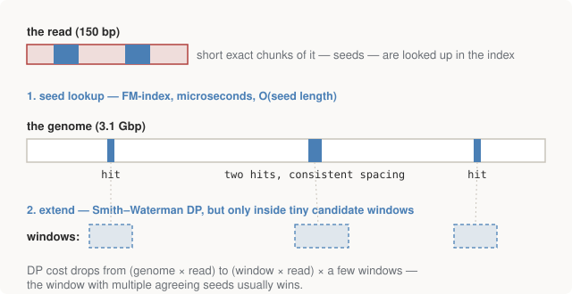

# Chapter 7 — Why You Can't Align a Genome This Way

Chapter 6 ended with a working Smith–Waterman and a warning about O(mn).
This short chapter does the arithmetic that makes the warning concrete, and
then explains the two ideas — one heuristic, one a genuinely beautiful data
structure — that turned alignment from impossible into a laptop task. This
is the mental model you need for `bwa` in Part IV; without it, the pipeline
there is a black box.

## The arithmetic of despair

The numbers, from the repo's output — a real modern sequencing workload
against dynamic programming's real cost:

```text
WHY THIS DOESN'T SCALE
------------------------------------------------------------------------
  one 150bp read vs the human genome:
    3,100,000,000 x 150 = 465,000,000,000 DP cells
  a typical 30x whole genome is ~500,000,000 reads:
    2.32e+20 cells
  At a generous 1e9 cells/sec that is ~7 billion years.
```

(Where those workload numbers come from: sequencing a human genome to
"30×" **coverage** — each base covered by ~30 reads on average, the
standard depth for confident variant calling, as Part IV will make
concrete — at 150bp per read means roughly 500 million reads.)

Half the age of the universe, per genome. The gap between that and the ~1
hour `bwa` actually takes is nine-plus orders of magnitude, and you don't
close nine orders of magnitude by optimising constants. You close it by
refusing to do almost all of the work.

## Idea one: seed and extend

The observation: a read that truly belongs at some genome position will
almost always contain *short stretches that match there exactly* —
sequencing errors and real variants are sparse. So invert the problem:

1. **Seed** — find short exact matches between the read and the genome,
   cheaply.
2. **Extend** — run real (Smith–Waterman-style) DP only in the small
   windows around those seed hits.

<figure>
  
  <figcaption>Figure 7-1. Seed-and-extend. Exact-match lookups narrow 3.1 billion candidate positions down to a handful; the expensive DP from Chapter 6 runs only in the shaded windows. Chapter 6's algorithm isn't replaced — it's aimed.</figcaption>
</figure>

This is **BLAST** (1990), the most cited tool in the field's history, and
the trade is explicit: seed-and-extend is a **heuristic**. If a true
alignment location contains no exact seed match (possible, just rare), it
is never examined, and the optimality guarantee of Chapter 6 is gone. The
field took that deal — roughly 50× speedup at the cost of missing
essentially nothing in practice — and never looked back. There's a lesson
about production systems in that sentence.

Seed-and-extend still needs its step 1 to be fast: "find all exact
occurrences of this short string in 3.1 billion characters, instantly."
A hash table of k-mers works (BLAST's approach), but it's memory-hungry at
genome scale. The modern answer is better, and stranger.

## Idea two: the Burrows–Wheeler transform

The **Burrows–Wheeler transform** (BWT) was invented for *compression* —
it's the transform inside `bzip2`. Take a text, form all of its rotations,
sort them, and record the last column of the sorted rotation matrix. The
result is a permutation of the original text (same characters, reshuffled)
with two magic properties:

1. **It's reversible** — the original text can be reconstructed from the
   last column alone. (This is the non-obvious part, and the reason it's
   useful for compression: you can store the transformed text instead of
   the original.)
2. **It groups similar contexts together** — characters that precede
   similar text end up adjacent, producing long runs that compress well.
   That's what `bzip2` wants.

The genomics insight — Ferragina and Manzini's **FM-index** (2000),
implemented for genomes by **BWA** and **Bowtie** around 2009 — is that
property 2 can be exploited for *search*: because the BWT keeps contextual
neighbourhoods together, one can count and locate all occurrences of a
query string by walking it *backwards*, one character per step, each step a
couple of array lookups into the transformed text plus small auxiliary
tables. The cost of finding every exact occurrence of a seed is:

**O(query length). Independent of genome size.**

Read that again, because it's the punchline of the chapter. Not O(genome),
not O(log genome) — the genome's size drops out of the query cost entirely,
because the genome was paid for *once*, at index-build time. The index for
the whole human genome fits in a few GB of RAM. That is what
`bwa index` is doing during its ninety silent seconds in Part IV: computing
the BWT of chromosome 11 and its FM-index companions. Build once, query
half a billion times.

> **Why this is strange and wonderful:** a compression algorithm's internal
> transform, repurposed unchanged as a search index. The single biggest
> speedup in the history of genomics came from a data-structures trick, not
> from any biological insight. For a software engineer entering this field,
> that should read as encouragement — the field's bottlenecks are routinely
> computational, and imported CS regularly wins big.

## The full mental model for `bwa`

Putting Part II together, this is what happens to every read in Part IV's
pipeline, and you now understand each stage:

1. **Index** (once): BWT + FM-index of the reference genome.
2. **Seed**: exact-match lookups of chunks of the read via the FM-index —
   microseconds, O(read length).
3. **Chain and filter**: seed hits that agree on a genome location select
   a small candidate window (both strands are searched — half of all reads
   match as the reverse complement, Chapter 1).
4. **Extend**: affine-gap Smith–Waterman (Chapter 6, with Chapter 6's
   "real tools" scoring) inside those windows produces the final alignment
   — its position, its gaps, and a quality score for how confident the
   placement is.

The output of that process per read — where it landed, how it aligned,
how confident the aligner is — needs a file format, and that format (SAM,
with its CIGAR strings and mapping qualities) is one of the stars of
Part III.

## Run it

```bash
python 02-rosalind/alignment.py
```

The final section of the output is this chapter's arithmetic.

## Further reading

- Compeau & Pevzner, *Bioinformatics Algorithms* — has a full, gentle
  construction of the BWT and FM-index; the best place to see the
  reversibility trick actually worked.
- Li & Durbin (2009), "Fast and accurate short read alignment with
  Burrows–Wheeler transform" — the BWA paper. Readable after this chapter.
