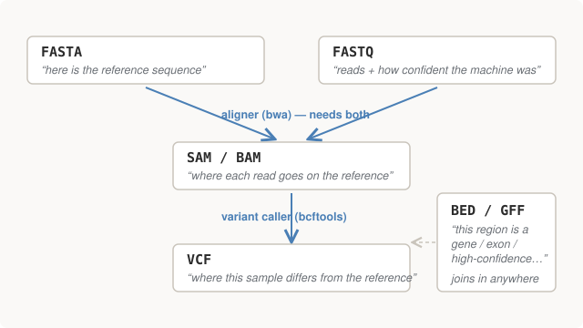
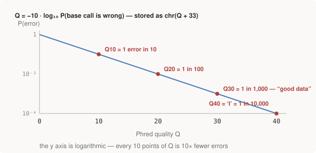

# Chapter 8 — Sequences on Disk: FASTA and FASTQ

Part III is the part with no intellectual glamour and maximum practical
payoff: **file formats and coordinate conventions cause the overwhelming
majority of real genomics bugs**, and nearly all of them fail silently.
The algorithms of Part II fail loudly — a wrong alignment score is visibly
wrong. A coordinate that's off by one, or a chromosome name that doesn't
match, produces *zero results with no error*, which reads exactly like a
biological finding.

The formats stop looking arbitrary the moment you place them in pipeline
order — each exists at a specific stage, answering a specific question:

<figure>
  
  <figcaption>Figure 8-1. The format zoo in pipeline order. This diagram is also the table of contents for Part III — and the pipeline it depicts is exactly what Part IV runs on real data.</figcaption>
</figure>

This chapter covers the two input formats: the reference (FASTA) and the
reads (FASTQ). From here on, the book's examples come from module 03, which
builds a complete tiny dataset around our old friend: the real hg38 HBB
locus, with the sickle variant rs334 planted into simulated reads. Known
truth in, pipeline's answer out — the design that Part IV repeats with real
data and a published truth set.

## FASTA: "here is the sequence"

You met FASTA in Chapter 5. The full spec barely needs more space:

```text
>chr11:5225464-5229395
TTGCAATGAAAATAAATGTTTTTTATTAGGCAGAATCCAGATGCTCAAGGCCCTTCATAA
TATCCCCCAGTTTAGTAGTTGGACTTAGGGAACAAAGGAACCTTTAATAGAAATTGGACA
...
```

A header line starting `>`, then sequence wrapped at 60–80 characters,
until the next `>`. That's the entire format. The human reference genome is
a ~3GB FASTA file with 25 primary headers (chr1–22, X, Y, M). The two
practical notes that matter:

- **The wrapping breaks naive parsers** — one line is not one record
  (Chapter 5's `parse_fasta` exists because of this).
- **The header is load-bearing.** The header above encodes which build and
  which region the slice came from — because a bare sequence with no
  provenance is uninterpretable, as Chapter 11 will make painful.

The repo's `make_data.py` fetches this slice live from the UCSC Genome
Browser's REST API, and even the fetch carries a lesson — the API takes
0-based half-open coordinates while humans quote 1-based, so the code
subtracts one from the start and not the end (Chapter 11's conversion rule,
in miniature):

```python
def fetch_reference():
    """UCSC's REST API. Note it takes 0-BASED, half-open coordinates, while
    the numbers above are 1-based -- so we subtract 1 from the start only.
    This conversion is footgun #1 in miniature."""
    url = (f"https://api.genome.ucsc.edu/getData/sequence?genome={BUILD}"
           f";chrom={CHROM};start={START_1BASED - 1};end={END_1BASED}")
```

## FASTQ: reads, with an honesty score attached

A **sequencing read** is a short fragment of sequence as reported by the
machine — for standard Illumina sequencing, ~150 bases. A sequencing run
produces hundreds of millions of them, in **FASTQ**: four lines per read,
always, in this order:

```text
@read0
CTCCTTTGCAAGTGTATTTACGTAATATTTGGAATCACAGCTTGGTAAGC...
+
FHGH@AIEII?@BHFHGCIIG@DG@@C???EHI@?@@FABBAEE?H?EH@...
```

Line 1 is an identifier, line 2 the called bases, line 3 a separator
(historically a repeat of the identifier; now vestigial), and line 4 —
the reason the format exists — one character *per base* answering the
question the naked sequence can't: **how sure is the machine about this
call?**

## Phred scores: confidence as a log scale

Each quality character encodes a **Phred score**:

```text
Q = -10 · log10( P(base call is wrong) )
```

So Q10 means 1 error in 10, Q20 means 1 in 100, Q30 — the conventional
"good data" threshold — 1 in 1,000. The score is stored as a printable
character with an ASCII offset of 33: `chr(Q + 33)`, so `I` = ASCII 73 =
Q40. (Why 33? It's the first printable ASCII character, `!`. Why encode at
all? One character per base keeps the file dense and line 4 exactly as long
as line 2.)

<figure>
  
  <figcaption>Figure 8-2. The Phred scale. Like decibels, it's a log scale of something you multiply — which is exactly what the variant caller will do with these numbers in Chapter 10.</figcaption>
</figure>

The repo's `dissect.py` decodes a real read's quality string — actual
output:

```text
FASTQ -- the quality string is the whole point
--------------------------------------------------------------------------
  decoding the first few:  Q = ord(char) - 33
      char    Q     P(error)   meaning
         F   37     0.000200   1 in 5,012
         H   39     0.000126   1 in 7,943
         G   38     0.000158   1 in 6,310
         H   39     0.000126   1 in 7,943
         ?   30     0.001000   1 in 1,000
         @   31     0.000794   1 in 1,259
```

> **Why quality scores are the whole point.** Every downstream statistical
> decision — above all "is this a real variant or a sequencing error?" —
> is a likelihood computation over these numbers. A pile of reads
> disagreeing with the reference at Q40 is evidence; the same pile at Q12
> is noise. The caller doesn't *filter* on quality, it *weights* by it —
> multiplying per-base error probabilities into its model. Quality scores
> are the reason variant calling is Bayesian rather than a counting
> exercise, as Chapter 10 shows concretely at the pileup.

## Simulating reads: sequencing, seen from the inside

Module 03 doesn't download reads — it *simulates* them, because simulated
reads come with exactly known truth. The simulator is a compact description
of what a sequencer (plus your own diploid genome) actually does, worth
reading line by line:

```python
def simulate_reads(ref, ref_offset, fastq_path):
    """Two haplotypes: one reference, one carrying rs334. Sample reads from
    both, add sequencing errors, write FASTQ."""
    hap_ref = ref
    idx = RS334_POS - ref_offset            # 0-based index into our slice
    assert hap_ref[idx] == RS334_REF, "reference base mismatch -- wrong build?"
    hap_alt = hap_ref[:idx] + RS334_ALT + hap_ref[idx + 1:]

    n_reads = (len(ref) * COVERAGE) // READ_LEN
    ...
        for i in range(n_reads):
            hap = hap_ref if i % 2 == 0 else hap_alt     # heterozygous: 50/50
            start = random.randint(0, len(hap) - READ_LEN)
            read = list(hap[start:start + READ_LEN])
```

Everything Part I built is doing work here:

- **Two haplotypes** — you carry two copies of chromosome 11 (Chapter 4),
  and this sample is heterozygous for rs334, so reads are drawn 50/50 from
  a reference copy and a sickle copy. That 50/50 is the signature the
  variant caller must later recognise.
- **Errors are injected at ~Q30 rates** (`ERROR_RATE = 0.001`), and —
  matching real machine behaviour — the erroneous bases are assigned *low*
  quality scores. The FASTQ knows, statistically, where its own lies are.
- **Half the reads are reverse-complemented** before writing (`i % 4 in
  (2, 3)`), because real fragments come off either strand (Chapter 1). Note
  the quality string gets reversed with the bases — base 0's quality must
  stay glued to base 0 wherever it ends up.
- **Coverage**: `COVERAGE = 50` means each position of the region is
  covered by ~50 reads on average — the read count is chosen as
  `len(ref) × 50 / 150`. "50× coverage" is the standard way sequencing
  depth is quoted, and depth is what buys statistical confidence.
- The `assert` on the reference base is Chapter 4's build-mismatch
  tripwire, now guarding a real download.

One more subtlety hides in the header comment of `make_data.py`: rs334 is
planted as `T>A` — but Chapter 4 called it `A>T`. Both are right. **HBB is
transcribed from the minus strand** of chromosome 11, so the coding
sequence Part I worked with is the reverse complement of the genome's plus
strand, where variants are conventionally reported. Same physical event,
two strand conventions — Chapter 1's warning, now with a database entry.

## Run it

```bash
conda activate bio                     # Setup chapter
python 03-formats/make_data.py        # fetch HBB slice, simulate reads (~4KB download)
python 03-formats/dissect.py          # after run.sh; its FASTQ section is this chapter
```

## Further reading

- Buffalo, *Bioinformatics Data Skills*, Ch. 10 — sequence formats, with
  war stories. This part of the book is essentially a guided tour of
  Buffalo's territory; if you read one companion text, read this one.
