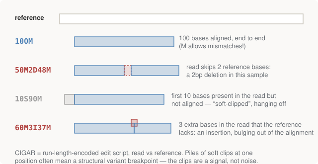

# Chapter 9 — Alignments on Disk: SAM and BAM

Chapter 7 left `bwa` producing, for each read, an answer: where it goes on
the reference, how it aligns there, and how confident the placement is.
**SAM** (Sequence Alignment/Map) is the text format that answer is written
in; **BAM** is its compressed binary twin. Between them they are the
centre-of-gravity format of all genomics — the file your disk fills up
with, and the file every downstream tool reads.

## Producing one: the canonical commands

Module 03's `run.sh` runs the sequence you will type, in some form, forever
(annotations abridged; the script's comments are fuller):

```bash
# 1. index the reference (the BWT/FM-index from Chapter 7, built once)
bwa index HBB.hg38.fa
samtools faidx HBB.hg38.fa        # .fai: a simpler index for coordinate seeks

# 2. align reads -> SAM
bwa mem -R "@RG\tID:run1\tSM:NA_sim\tPL:ILLUMINA" HBB.hg38.fa sample.hg38.fastq > aligned.sam

# 3. sort and compress -> BAM, then index it
samtools sort -o sorted.bam aligned.sam
samtools index sorted.bam
```

The `-R` flag plants a **read group** (`@RG`) header — metadata declaring
which sample (`SM:`) these reads belong to. It looks bureaucratic; it
isn't optional in practice, because variant callers refuse to run without
knowing which sample each read came from (imagine multiplexing several
patients through one machine run — mixing up whose reads are whose is not
a recoverable error).

## Anatomy of a SAM record

A SAM file is header lines (starting `@`) then one line per alignment,
with 11 mandatory tab-separated columns. Here's a real line from the
module's `aligned.sam`, then the columns that matter:

```text
read0  0  chr11:5225464-5229395  1853  60  150M  *  0  0  CTCCTTTGCA...  FHGH@AIEII...
```

| Column | Name | This read | Meaning |
|--------|------|-----------|---------|
| 2 | `FLAG` | `0` | bitfield of read properties (below) |
| 3 | `RNAME` | `chr11:…` | reference sequence the read aligned to |
| 4 | `POS` | `1853` | leftmost aligned position, **1-based** |
| 5 | `MAPQ` | `60` | confidence the *placement* is right (below) |
| 6 | `CIGAR` | `150M` | how the read aligns, base by base (below) |
| 10 | `SEQ` | `CTCC…` | the read's bases |
| 11 | `QUAL` | `FHGH…` | the read's Phred string, from the FASTQ |

Columns 7–9 describe the read's mate for paired-end sequencing — Part IV
uses them; this module's simulated reads are unpaired. Three of these
columns deserve their own sections, because each encodes a small language.

### FLAG: twelve booleans in one integer

`FLAG` is a bitfield. Bit `0x10` set means the read aligned to the
reverse strand (Chapter 1's promise: half your reads); `0x4` means it
failed to align at all; `0x400` means it's a PCR duplicate (Part IV);
`0x1`/`0x40`/`0x80` describe pairing. A FLAG of 99 is not an ID — it's
`1+2+32+64`. The repo decodes them with exactly the loop you'd write:

```python
def decode_flag(flag):
    bits = [
        (0x1, "paired"), (0x2, "properly paired"), (0x4, "unmapped"),
        (0x8, "mate unmapped"), (0x10, "REVERSE strand"), (0x20, "mate reverse"),
        (0x40, "first in pair"), (0x80, "second in pair"),
        (0x100, "secondary alignment"), (0x200, "QC fail"),
        (0x400, "PCR duplicate"), (0x800, "supplementary"),
    ]
    return [name for bit, name in bits if flag & bit]
```

And from `dissect.py`'s real output, one read from each strand:

```text
  forward-strand read: read9
    FLAG        0  = all bits clear
    POS         7  (pysam gave 6, 0-based -- the file says 7)
    MAPQ       60  (60 = uniquely placed; 0 = maps elsewhere too)
    CIGAR    150M  = 150 aligned

  reverse-strand read: read555
    FLAG       16  = REVERSE strand
```

(That `pysam gave 6` aside is not a typo — it's Chapter 11's trap visible
inside a library API: the file on disk is 1-based, but `pysam` reports
0-based coordinates to match Python slicing. It catches everyone once.)

### MAPQ: confidence about *place*, not *bases*

`MAPQ` is a Phred-scaled probability (Chapter 8's scale, reused) that the
read's *placement* is wrong. It is entirely distinct from base quality:
the machine can be certain of every base while the aligner is uncertain
where the read belongs — because the genome is full of repeated sequence,
and a read from a repeat matches many places equally well. Such a read
gets **MAPQ 0**: "I had to put it somewhere, but don't trust the address."

```text
  MAPQ distribution across the first 400 reads:
    MAPQ  60  ######################################## 400
  All 60 here because this is one clean, non-repetitive gene.
  On a whole genome you would see a fat MAPQ 0 spike -- repeats,
  where a read genuinely cannot be placed. Filtering those out is
  the highest-leverage single filter in the field.
```

Part IV's error analysis will trace real false positives to piles of
MAPQ-0 reads. When a variant call looks weird, "what's the MAPQ around
here?" is the first question a practitioner asks.

### CIGAR: the alignment itself, run-length encoded

`CIGAR` compactly describes how the read lies against the reference — the
output of Chapter 6's traceback, serialised. It's a run-length-encoded
edit script: `150M` = 150 bases aligned; `50M2D48M` = 50 aligned, a 2-base
deletion (read skips reference bases), 48 aligned; `10S90M` = first 10
bases **soft-clipped** (present in the read, left unaligned), 90 aligned.

<figure>
  
  <figcaption>Figure 9-1. CIGAR operations as geometry. One trap: M means "aligned", not "matches" — a substitution is still M. (The pedantic operators = and X exist but are rarely used.)</figcaption>
</figure>

Soft clips deserve their reputation as a signal: one clipped read is
noise, but a *pile* of reads all clipped at the same position means the
sample's DNA continues with something the reference doesn't have there —
the classic signature of a structural variant breakpoint.

## BAM: the same thing, engineered

SAM is text — greppable, teachable, and far too large (a 30× human genome
is ~100GB of SAM). **BAM** is the same records BGZF-compressed: gzip
applied in independent blocks, so the file is both ~5× smaller *and*
seekable. Coordinate-**sort** it, build a `.bai` **index**, and any tool
can jump straight to `chr11:5,227,002` in a 100GB file without reading
the preceding gigabytes — this is the trick that Part IV will use to
slice reads out of a 250GB file on a server without downloading it.

Sort-then-index is a ritual you'll type constantly, and the module shows
the payoff at toy scale — `aligned.sam` is 507KB, `sorted.bam` is 120KB,
and the `.bai` index is 96 bytes. Then the ten-second sanity check:

```text
== 4. alignment statistics =====================================
   1310 + 0 in total (QC-passed reads + QC-failed reads)
   1310 + 0 primary
   1310 + 0 mapped (100.00% : N/A)
```

`samtools flagstat` reads the FLAG bits across the whole file and
summarises: here, all 1,310 simulated reads mapped, none were duplicates,
none paired — exactly what a clean single-end simulation should show. (CRAM is the
next step in this direction — it stores only differences from the
reference, at the price of needing the reference to read the file back.)

## Run it

```bash
bash 03-formats/run.sh          # steps 1-4 are this chapter
python 03-formats/dissect.py    # its SAM/BAM section decodes the fields
```

## Further reading

- Buffalo, *Bioinformatics Data Skills*, Ch. 11 — SAM/BAM in full,
  including the tag fields this chapter skipped.
- The [SAM specification](https://samtools.github.io/hts-specs/) — tersely
  definitive, and genuinely useful as a reference once this chapter has
  made it readable.
