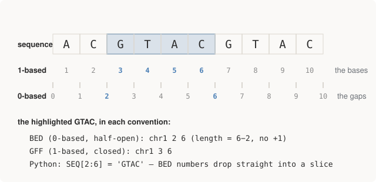

# Chapter 11 — Coordinates, Builds, and Silent Wrongness

This chapter is about the two conventions that cause more real genomics
bugs than everything else in this book combined: how positions are
numbered, and which version of the reference the numbers refer to. Neither
involves any biology. Both fail silently. The module's own framing is the
right one — *read this once, believe it, and you will still get bitten;
but you'll recognise the symptom, which is the actual goal.*

## Footgun 1: 0-based vs 1-based

The field never standardised how to number positions, so both conventions
are in active use, often inside a single pipeline:

| Format | Coordinates |
|--------|-------------|
| BED | **0-based, half-open** `[start, end)` |
| GFF/GTF | 1-based, closed |
| SAM/BAM | 1-based in the file; **0-based in the pysam API** |
| VCF | 1-based |
| UCSC browser | 1-based display, 0-based under the hood |

The clean way to hold the two systems in your head: **1-based numbers the
bases; 0-based numbers the gaps between them.**

<figure>
  
  <figcaption>Figure 11-1. One feature, two coordinate systems. 0-based half-open intervals are Python slices; 1-based closed intervals are how humans (and GFF, VCF, SAM) count.</figcaption>
</figure>

The demonstration from `coordinates.py`, on a 10-base toy chromosome —
note the failure is *silent*:

```text
  sequence      ACGTACGTAC
  We want to describe the GTAC at positions 3-6 (1-based).

  BED     chr1  2  6      0-based, half-open  -> start=2, end=6
  GFF     chr1  3  6      1-based, closed     -> start=3, end=6
  VCF     POS=3           1-based
  pysam   start=2         0-based in the API, reading the same file

  Python slice:  SEQ[2:6] = 'GTAC'   <- BED numbers work directly
  Naive 1-based: SEQ[3:6] = 'TAC'    <- off by one, silently
```

`'TAC'` is a perfectly plausible answer. Nothing raised. That's the whole
danger, compressed into two lines.

**BED's choice is not arbitrary** — 0-based half-open has exactly the
virtues that made Python choose it for slices:

```text
  length          = end - start        (no +1 to forget)
  adjacent blocks = [0,5) and [5,10)   (no ambiguity about 5)
  empty interval  = [5,5)              (representable at all)
```

GFF predates the argument and stayed 1-based because biologists count
from 1. Both are defensible; the coexistence is the problem.

**The conversion rule — only the START moves:**

```text
  BED -> 1-based:   start + 1, end unchanged
  1-based -> BED:   start - 1, end unchanged
```

Adjusting the end as well is *the* classic converter bug, and it produces
intervals one base short — which looks fine until a variant sits exactly
on the boundary, at which point it's excluded from an analysis and nobody
knows.

## Footgun 2: reference builds

The reference genome is versioned. **hg19/GRCh37** (2009) and
**hg38/GRCh38** (2013) are both still in wide use, and they are *different
coordinate systems for the same molecule* — hg38 fixed assembly errors and
added sequence, shifting downstream coordinates. The same physical base
has two different addresses:

```text
  rs334, the sickle-cell variant:
    hg19 / GRCh37   chr11:5,248,232
    hg38 / GRCh38   chr11:5,227,002
```

A 21,230-base difference. Neither is wrong; a position is only meaningful
*jointly with its build*. And mixing builds does not error: feed hg19
coordinates to an hg38 reference and you get a real base at a real
position in a real gene — just the wrong one. Plausible nonsense, again.

Symptoms and defences:

- **Symptom:** your VCF's REF allele doesn't match the reference base at
  that position. This is why `make_data.py` asserts the reference base
  before planting a variant, why Chapter 10 called VCF's REF column an
  integrity check, and why "assert REF matches" appears in every layer of
  this repo.
- **Symptom:** zero overlaps between two files that should overlap
  heavily. Before suspecting biology, suspect that one file is hg19.
- **Conversion** between builds exists (`liftOver`, `CrossMap`) but is
  imperfect by nature — some regions of one build have no equivalent in
  the other. Never hand-convert.

Compounding it, a gratuitous naming split: for the same build, UCSC-style
files say `chr11`, `chrM`, `chrX` while Ensembl-style files say `11`,
`MT`, `X`. Tools don't reconcile these — they find zero matches and
report an empty result, *which reads as a biological finding*. Half of
real bioinformatics debugging is chromosome-name and build
reconciliation; Part V's fetch script will hit this exact split for real
(its 1000 Genomes data is GRCh37 with Ensembl names, unlike Part IV's
GRCh38/UCSC — mixing them yields silent zeroes).

## The habits

From the end of `coordinates.py`, the five habits that make these bugs
cheap instead of expensive — the closest thing this book has to
commandments:

```text
  1. Put the build in every filename:   sample.hg38.bam
  2. Assert REF matches the reference before trusting a VCF.
  3. When a tool returns zero results, suspect naming before biology.
  4. Never hand-convert coordinates; use liftOver/CrossMap and
     accept that some regions have no equivalent at all.
  5. Look at the BAM in IGV. Off-by-one errors are visible there
     in a way they never are in a summary statistic.
```

(IGV — the Integrative Genomics Viewer — is a desktop app that renders
BAMs and VCFs as browsable read stacks, like `dissect.py`'s pileup but
interactive and genome-wide. "Look at your data" survives the transition
to genomics fully intact.)

## The toolbox, surveyed

Part III has now used most of the core command-line suite; here's the map
of what exists, including tools later Parts will meet:

| Tool | Job |
|------|-----|
| `samtools` | Everything BAM: view, sort, index, stats, depth, pileup |
| `bcftools` | Everything VCF: call, filter, query, stats, isec (set ops) |
| `bedtools` | Interval arithmetic: intersect, merge, subtract, coverage |
| `bwa` / `minimap2` | Alignment (short reads / long reads) |
| `fastqc` | Read quality control |
| `GATK` | The heavyweight variant caller; more accurate, far more ceremony |
| `VEP` / `SnpEff` | Variant annotation — consequence, gene, protein change |
| `IGV` | Look at your BAM. Many bugs are visible to eyes and invisible to stats |

`samtools`/`bcftools`/`bedtools` compose over pipes exactly like Unix
tools, because they were designed by people who thought that way. Shell
instincts transfer directly.

## Run it

```bash
python 03-formats/coordinates.py
```

## Further reading

- Buffalo, *Bioinformatics Data Skills*, Ch. 9 — ranges and coordinate
  systems, at book length.
