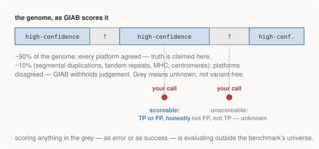

# Chapter 13 — What Truth Looks Like: HG002 and GIAB

Part III ended with a pipeline that recovered a planted variant — a
rehearsal with rigged ground truth. Part IV runs the same shape of pipeline
on **real sequencing reads from a real person**, and then does the thing
that makes it worth more than the rest of the repo combined: **measures how
wrong it is**. That requires an answer key for a human genome. This chapter
is about where such a thing can possibly come from, and what its fine print
means — the fine print turns out to be the intellectually serious part.

## The sample: HG002

**Genome in a Bottle (GIAB)** is a NIST-led consortium that took a handful
of consented individuals and turned them into reference materials — the
metrology approach applied to genomes. For each: sequence on *every
platform in existence* (Illumina at 300× depth, PacBio, Oxford Nanopore,
10X, Complete Genomics, SOLiD, Ion Torrent), run many independent analysis
pipelines, and integrate everything into a **benchmark VCF**: the
best-available statement of what variants this person actually carries.
Where independent technologies with *uncorrelated error modes* all agree,
the consensus is about as close to truth as observational science gets.

**HG002** (also catalogued as NA24385) is the most-sequenced human in
history: the son in an Ashkenazi Jewish trio, with mother (HG004) and
father (HG003) also fully characterised. The parents matter because
inheritance is a constraint: nearly every variant in the child must appear
in a parent. A "variant" in the child absent from both parents is either a
genuinely rare de novo mutation (a few dozen per genome) or — far more
often — an error. **Trio consistency** is one of the strongest truth
signals available in genomics, and it costs nothing but sequencing the
family.

Two files from the GIAB release matter for everything that follows:

- `HG002_GRCh38_1_22_v4.2.1_benchmark.vcf.gz` — the truth variants
  (note the build, per Chapter 11's habit — it's in the filename).
- `HG002_..._benchmark_noinconsistent.bed` — the **high-confidence
  regions**. This is the crucial one.

## The high-confidence BED: the intellectually important file

GIAB does not claim to know HG002's whole genome. It claims to know about
**90%** of it. The other ~10% — segmental duplications, long tandem
repeats, the MHC region, centromeres — is where the platforms *disagreed
with each other*, so GIAB withheld judgement. The BED file lists the
intervals where truth is claimed; everything outside is not "variant-free"
but **unknown**.

<figure>
  
  <figcaption>Figure 13-1. The benchmark defines a universe. Inside it, your calls can be scored. Outside it, a call is neither right nor wrong — it is unscoreable, and pretending otherwise biases the result in whichever direction you chose.</figcaption>
</figure>

The consequence for scoring is absolute: **a variant called outside the
high-confidence BED cannot be scored.** Count it as a false positive and
you punish yourself for GIAB's ignorance; count it as correct and you
flatter yourself. The only honest procedure is to restrict *both* your
calls and the truth set to the confident regions before comparing —
which is exactly what the pipeline's step 9 does in the next chapter.

If you come from finance, this is survivorship bias discipline, exactly:
the benchmark defines the investable universe, and any statistic computed
outside the universe is meaningless regardless of how good it looks. Most
published "our caller achieves 99.5%" claims live or die on precisely this
restriction, and the field learned it the hard way — early callers looked
better than they were because everyone unconsciously evaluated on the easy
90% *plus whatever they happened to get right elsewhere*.

There's a subtler bias worth naming too, because it never goes away: the
excluded 10% isn't a random sample of the genome. It's the *hard* 10% —
hard for the benchmark's technologies for the same reasons it's hard for
yours. So every benchmark number in the next two chapters is implicitly
"performance on the easier 90%", and real-world performance on the full
genome is worse than any number you'll see. Benchmarks are maps, not
territory; this one is at least honest about where the map ends.

> **Why these regions are hard, in one paragraph.** Segmental duplications
> are long stretches present in near-identical copies — Chapter 9's MAPQ-0
> problem at kilobase scale: reads can't be confidently placed in *this*
> copy versus *that* one. Tandem repeats (the same short unit repeated
> many times) make indel placement ambiguous — Chapter 15's representation
> problem in its natural habitat. The MHC is the most polymorphic region
> of the human genome, so different people differ from the reference so
> much that alignment itself gets ambiguous. All three are alignment
> pathologies, not chemistry pathologies — the reads are fine; the
> *placement* is uncertain.

## What "truth" means here, and what it doesn't

A calibrated view of the benchmark VCF, before we go score against it:

- It is a **consensus under disagreement**, not an oracle. The GIAB
  papers (Zook et al.) are mostly methodology about arbitrating
  conflicts between platforms — read one and the "truth set" stops
  feeling like received wisdom and starts feeling like careful
  engineering with error bars.
- It is **versioned** (v4.2.1 here), and versions change: regions get
  added as technologies improve (long reads rescued big chunks of the
  previously-excluded genome between v3 and v4).
- It is truth about **one person**. HG002's genome contains a sample of
  human variation, not all of it — a caller scoring well here can still
  fail on variant types HG002 happens not to carry.

None of this diminishes the achievement. It means the right posture
before a benchmark is the one this Part is built around: know exactly
what universe you're being scored on, restrict yourself to it honestly,
and read the errors rather than the headline number.

## Run it

Nothing to run yet — this chapter is the setup. The next chapter fetches
the data:

```bash
bash 04-pipeline/fetch_data.sh     # ~60MB download, ~460MB on disk
```

## Further reading

- Zook et al., the GIAB benchmark papers — short, and the methodology is
  the interesting part: consensus-under-disagreement, not biology.
- [GIAB's release notes](https://www.nist.gov/programs-projects/genome-bottle)
  for how the high-confidence regions have grown across versions.
