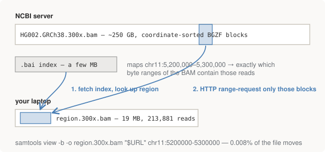

# Chapter 14 — FASTQ → BAM → VCF, For Real

This chapter runs the pipeline. Every step exists in module 03's toy
version; what's new is that each step now has a *real-world reason* — the
kind that only shows up when the reads come from an actual sequencer and an
actual person. The region is an old friend: `chr11:5,200,000–5,300,000`,
the beta-globin locus, containing the HBB gene from Parts I and III.

## Getting the data: the remote slicing trick

The HG002 300× BAM sits on NCBI's servers at about **250GB**. We need
0.008% of it. The fetch script does not download the file:

```bash
HG002=https://ftp-trace.ncbi.nlm.nih.gov/.../HG002.GRCh38.300x.bam
samtools view -b -o region.300x.bam "$HG002" chr11:5200000-5300000
```

<figure>
  
  <figcaption>Figure 14-1. Remote indexed access. Everything Chapter 9 said about sorted, BGZF-blocked, indexed BAMs pays off here: the index maps a genomic region to byte ranges, and HTTP serves byte ranges. 19MB moves instead of 250GB.</figcaption>
</figure>

This works because of exactly the engineering Chapter 9 described:
the BAM is coordinate-sorted and BGZF-compressed in independent blocks,
and the `.bai` index maps genomic intervals to byte offsets. `samtools`
fetches the small index, computes which blocks cover our region, and
issues HTTP range requests for just those — 213,881 reads, 19MB. Remote
indexed slicing is one of the most useful and least-known tricks in the
field, and Part V will use it again on a 1000 Genomes VCF.

The reference is chromosome 11 *in full* (~131MB expanded) rather than a
slice — deliberately, so every coordinate in the pipeline is a real
genomic coordinate and no offset arithmetic exists anywhere for bugs to
hide in. Chapter 11's lessons, applied as architecture. The `bwa index`
build takes ~90 silent seconds (Chapter 7's BWT construction; the full
genome would be ~1 hour and 5GB).

## The pipeline, step by step

`run.sh` is nine numbered steps; here is each with its reason. The
command lines are abridged — the script's comments carry the full detail.

**1. Downsample 300× → ~30×.**

```bash
samtools view -b -s 11.10 region.300x.bam > region.30x.bam
```

300× is a benchmark luxury; ~30× is what a real clinical/research genome
gets, so it's the honest depth to test at. (`-s 11.10`: samtools reads the
integer part as a random seed and the fraction as the keep-probability —
a genuinely unguessable flag convention.) 213,881 reads become 21,457.

**2. Back to FASTQ.** The downloaded reads arrive *already aligned* (by
GIAB's pipeline). We strip them back to raw FASTQ and realign from
scratch — otherwise we'd be benchmarking someone else's aligner.
`samtools collate` groups mates together first, because the FASTQ
converter must emit R1/R2 in matched order.

**3. Align, paired-end.**

```bash
bwa mem -t 8 -R "@RG\tID:hiseq\tSM:HG002\tPL:ILLUMINA" chr11.fa R1.fastq R2.fastq \
  | samtools fixmate -m - - \
  | samtools sort -o hg002.sorted.bam -
```

New versus module 03: **paired ends**. Illumina sequences both ends of
each ~350bp fragment, so reads come in mate pairs with a roughly known
gap between them. That known geometry is extra information — it's how
repeats get resolved (a repeat-landing read with a uniquely-placed mate
inherits confidence from the mate) and how structural variants announce
themselves (mates that land too far apart, too close, or inverted).
Chapter 9's mate columns, finally in use.

**4. Mark PCR duplicates.**

```bash
samtools markdup -s hg002.sorted.bam hg002.markdup.bam
```

Library preparation PCR-amplifies fragments before sequencing, so some
"reads" are photocopies of the same original molecule. Photocopies are
not independent evidence: an error that happened in an early PCR cycle
appears in every copy, and a caller that counts copies separately sees a
consistent, high-quality, well-supported "variant" that is actually one
molecular accident. Marking duplicates (same start, same mate position ⇒
flag `0x400`, Chapter 9) is the cheapest step with a real accuracy
payoff.

**5. Coverage check.** `samtools depth` over the evaluation window
confirms ~31× mean — depth is the denominator of every claim that
follows, so verify it rather than assume it.

**6. Call.** Same `bcftools mpileup | call` as Chapter 10, now with
`-a AD,DP` so every call records its allele depths — the next chapter's
error analysis needs them.

**7. Normalise.**

```bash
bcftools norm -f chr11.fa -m -any calls.raw.vcf.gz
```

Left-align indels and split multi-allelic records into one alt per line —
forcing every variant into a canonical spelling. Chapter 15 explains why
comparison is meaningless without this; it's run on *both* our calls and
the truth so both sides speak the same dialect.

**8. Fetch truth, build the honest universe.** The GIAB truth VCF is
sliced remotely by region (the same trick again), normalised identically.
The high-confidence BED is downloaded and intersected with our evaluation
window:

```bash
bedtools intersect -a highconf.full.bed -b eval.bed > highconf.bed
```

The evaluation window itself is trimmed (`chr11:5,205,000–5,295,000`)
because the edges of the fetched region have partial coverage — reads
overlapping the boundary were only partly retrieved, and calling into
that taper would manufacture fake misses.

**9. Restrict and intersect.** Both VCFs are cut down to the
high-confidence regions (Chapter 13's honesty requirement), then:

```bash
bcftools isec -p isec truth.hc.vcf.gz calls.hc.vcf.gz
```

`isec` is set intersection over VCFs, and its three output files *are*
the confusion matrix: `0000.vcf` = truth only (**false negatives**),
`0001.vcf` = calls only (**false positives**), `0002.vcf` = both
(**true positives**). Scoring them is the next chapter.

## What a production pipeline has that this one doesn't

Align → sort → markdup → call is the honest skeleton. Production adds,
roughly in order of impact:

- **Local realignment / haplotype assembly.** Around indels,
  column-by-column pileup calling is unreliable — each read aligns its
  indel slightly differently, smearing the evidence across positions.
  GATK's HaplotypeCaller instead *reassembles* the local region from the
  reads and evaluates candidate haplotypes as wholes. This is the single
  biggest accuracy gap between `bcftools call` and GATK, and (spoiler)
  every error in the next chapter lives exactly where this paragraph
  predicts: at indels.
- **Base quality score recalibration (BQSR).** Sequencers' self-reported
  Phred scores are systematically biased by machine cycle and sequence
  context; GATK re-derives them empirically. Chapter 8 said the caller
  believes the quality string — BQSR makes it more worthy of belief.
- **Filtering.** VQSR (a learned filter over call annotations) or hard
  thresholds on depth, quality, and strand bias. We deliberately apply
  none, so the raw error profile stays visible.

And the state of the art is a different thing entirely: **DeepVariant**
renders the pileup as an image and runs a CNN over it, beating the
hand-engineered statistical callers. That result is worth sitting with:
the biology was fine, the alignment was fine — *the likelihood model was
the bottleneck*, and a learned model beat the hand-built one. It says a
lot about where this field's remaining edge is, and for whom.

## Run it

```bash
bash 04-pipeline/fetch_data.sh    # once: reference + index + remote slice
bash 04-pipeline/run.sh           # the nine steps, ~2 minutes
```

## Further reading

- Buffalo, *Bioinformatics Data Skills*, Ch. 11.
- The [DeepVariant paper](https://www.nature.com/articles/nbt.4235)
  (Poplin et al. 2018) — readable, and the pileup-as-image idea is fully
  graspable with this book's vocabulary.
