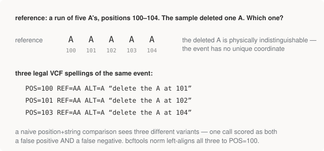

# Chapter 15 — Keeping Score

The pipeline has run; `isec/` holds the three-way split against truth.
This chapter turns it into metrics, and then does the part that matters
more than the metrics: reads every single error and explains it. Three
false positives you understand are worth more than a precision figure you
don't.

## The metrics

With truth **T** and calls **C**, both restricted to the high-confidence
universe (Chapter 13):

- **TP** (true positive) — in both. **FP** — in C only. **FN** — in T only.
- **Precision** = TP / (TP + FP): *of what I called, how much was real?*
- **Recall** = TP / (TP + FN): *of what was there, how much did I find?*
- **F1** — their harmonic mean; the single number people quote.

Two disciplines before looking at any result. First, **the trade-off is a
dial, not a property of the pipeline**: loosen the calling threshold and
recall rises while precision falls. A caller has a precision–recall
*curve*; quoting one point without its threshold is how benchmarks
mislead. Second, **report SNPs and indels separately** — indels are far
harder, and a blended number hides exactly the weakness that matters.

## The result

`benchmark.py`'s real output, from the run this book was written against:

```text
HG002 (GIAB), chr11:5,205,000-5,295,000, ~31x, high-confidence only
--------------------------------------------------------------------------
  truth variants   187
  our calls        187

  class       TP    FP    FN    precision   recall      F1
  SNP        160     1     0       0.9938   1.0000  0.9969
  INDEL       24     2     3       0.9231   0.8889  0.9057
  ALL        184     3     3       0.9840   0.9840  0.9840
```

For a pileup caller with no recalibration, no haplotype assembly, and no
filtering (production references: SNPs ~99.5/99.5, indels ~99/95),
this is remarkably strong — **perfect SNP recall**, one SNP false
positive. And exactly as Chapter 14 predicted, every real problem is in
the indels. Note also the seductive symmetry of 187 truth / 187 called —
completely uninformative, since it says nothing about whether they're the
*same* 187. Only the intersection means anything.

## Reading the errors

Six errors: 3 FP, 3 FN. The whole point of this Part is what happens when
you look at them individually, so look:

```text
FALSE POSITIVES -- we called it, GIAB says it isn't there
--------------------------------------------------------------------------
  chr11:5,218,376  A>AT  (INDEL)
    QUAL 7.4   GT 0/1   DP 12   AD 10,2
    -> alt fraction well under 25%: too low for a real het.

  chr11:5,253,695  C>T  (SNP)
    QUAL 80.8   GT 0/1   DP 29   AD 5,11

  chr11:5,253,698  G>GCGCACA  (INDEL)
    QUAL 226.6   GT 1/1   DP 27   AD 6,17
```

The first FP is textbook noise: 2 alt reads out of 12, QUAL 7.4 — a
depth-and-allele-fraction filter (the "filtering" step our pipeline
deliberately skipped) would remove it at almost no recall cost. The other
two look convincing on paper — decent quality, decent depth. Hold them a
moment. Now the misses:

```text
FALSE NEGATIVES -- GIAB says it's there, we missed it
--------------------------------------------------------------------------
  chr11:5,218,376  A>ATAAGCTTTTTGATGTGCTGCTGGAT  (INDEL)   truth GT 1/1
    -> we DID call something within 10bp:
         chr11:5,218,376 A>AT

  chr11:5,253,693  C>CGT  (INDEL)   truth GT 1/1
    -> we DID call something within 10bp:
         chr11:5,253,695 C>T
         chr11:5,253,698 G>GCGCACA

  chr11:5,253,698  G>GCACA  (INDEL)   truth GT 1/1
    -> we DID call something within 10bp:
         chr11:5,253,695 C>T
         chr11:5,253,698 G>GCGCACA
```

Every FN sits within 10bp of an FP. **All six errors are two loci.** At
5,218,376, truth says "26bp insertion"; we said "1bp insertion" — same
place, same kind of event, wrong spelling, and the naive comparison
punishes it twice (one FP *and* one FN). At 5,253,693–698, truth's two
small insertions versus our SNP-plus-insertion — two descriptions of the
same local rearrangement, four errors on the scoreboard.

So the honest reading of this benchmark: **not a single false detection
of the "hallucinated a variant" kind, and not a single blind miss.** The
pipeline found every real event; what it got wrong — at two hard loci —
was how to *write down* complex indels. Which the depth check confirms:
none of the six sites has low coverage or MAPQ-0 pileups; these aren't
data problems.

## The representation problem

Why can the same event have multiple spellings? Because indels in
repetitive sequence have no unique coordinate:

<figure>
  
  <figcaption>Figure 15-1. Delete one A from a run of five: the result is identical regardless of which A "was deleted", so three different VCF records describe one physical event. In tandem repeats the ambiguity gets worse and compound.</figcaption>
</figure>

The fixes, in increasing order of correctness:

1. **Normalisation** (`bcftools norm`) — left-align every indel to its
   leftmost legal position, split multi-allelics. Cheap, necessary, and
   already in our pipeline (both sides of the comparison got it). It
   solves the *simple* cases — the figure's homopolymer collapses to one
   spelling.
2. **Haplotype comparison** (`hap.py`, `vcfeval`) — the semantically
   correct question: *do the two VCFs, applied to the reference, produce
   the same sequence?* If yes, they agree, however differently spelled.
   This is what the GA4GH benchmarking standard uses, and it exists
   precisely because normalisation can't reconcile compound differences
   like our SNP+insertion vs two-insertions case.

Our `bcftools isec` comparison is the naive set intersection, used
knowingly — and the errors it reports are a live demonstration of why the
proper tools exist. With `hap.py`, this pipeline's score at these loci
would likely be perfect or near it; the residual question would be
whether our *spelling* implies the same haplotype, which only haplotype
comparison can answer.

## The last section: absence, again

`benchmark.py` ends by asking a question this book has been building to
since Chapter 4 — is rs334 in here?

```text
Is the sickle-cell site in here?
--------------------------------------------------------------------------
  No variant at chr11:5,227,002 in either truth or our calls.
  HG002 carries the reference T on both chromosomes -- he does
  not have the sickle-cell allele, so there is nothing to call.
  Absence from a VCF means 'matches the reference', not 'no data'.
  That distinction is the most common misreading of a VCF.
```

We *know* it's "reference" rather than "no data" because step 5 verified
~31× coverage across the window — the reads are there, and they say `T`.
Chapter 10's warning, closed out with real data: a VCF you can trust is a
VCF whose coverage you've checked.

## Where Part IV leaves you

You have now run the full arc the field runs: real reads from a real
person, aligned with the data structures of Part II, flowed through the
formats of Part III, called, and scored — honestly, inside a declared
universe, with every error examined and understood. The numbers came out
excellent, and more importantly, the errors came out *explainable*, which
is the actual skill. Part V changes the question: instead of one genome
examined deeply, two and a half thousand examined together.

## Run it

```bash
python 04-pipeline/benchmark.py
```

## Further reading

- Krusche et al. (2019), the GA4GH benchmarking-standards paper — where
  hap.py-style haplotype comparison was codified.
- Zook et al. — the GIAB papers, again; after this chapter they read as
  colleagues describing shared problems.
