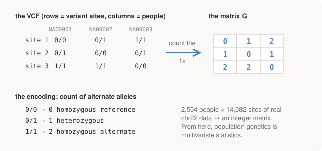

# Chapter 16 — Two Thousand Genomes as a Matrix

Part V changes the unit of analysis. Parts I–IV examined one genome at a
time, deeply; now the object is 2,504 genomes at once, and the questions
are about *structure between people*. This is the part of the book where,
if you come from statistics or quantitative finance, your existing skills
stop being transferable and simply **are** the skill: everything below is
linear algebra on a matrix, and all the biology lives in the
interpretation.

## The data: 1000 Genomes

The **1000 Genomes Project** was the field's first big open catalogue of
human variation: 2,504 people (Phase 3, 2015) from 26 populations, grouped
into five **superpopulations** — AFR (African), EUR (European), EAS (East
Asian), SAS (South Asian), AMR (Admixed American). SAS comprises GIH
(Gujarati), PJL (Punjabi), BEB (Bengali), STU (Sri Lankan Tamil), and ITU
(Telugu) — populations this book's author belongs among, which makes the
output of the next chapter personally legible in a way toy data never is.

The genotype data is published as one VCF per chromosome: rows are variant
sites, sample columns are people, and each cell is a genotype — Chapter
10's format, now with 2,504 sample columns instead of one.

The fetch is Chapter 14's remote-slicing trick again, this time on a VCF
(`bcftools` reading the remote `.tbi` index), pulling 5Mb of chromosome 22
with the filtering pushed into the query:

```bash
bcftools view -r 22:20000000-25000000 -m2 -M2 -v snps -q 0.05:minor \
    "$KG/ALL.chr22.phase3_...genotypes.vcf.gz" -Ou \
  | bcftools annotate -x INFO,^FORMAT/GT -Oz -o chr22.slice.vcf.gz
```

Two details are doing serious work here. First, the flags implement
quality control at the source: biallelic SNPs only (`-m2 -M2 -v snps`),
minor allele frequency above 5% (`-q 0.05:minor`) — more on why below.
Second, a Chapter 11 landmine defused in the region string: this dataset
is **GRCh37 with Ensembl-style names** (`22`, not `chr22`), unlike Part
IV's GRCh38/`chr11`. Mix the two conventions and you get the classic
silent zero-results failure — the fetch script's closing note says so out
loud.

The script also downloads `samples.panel` — which population each sample
belongs to — with a comment that matters for everything in Chapter 17:
**the labels are used only for colouring plots afterwards, never fed to
the analysis.**

## The whole trick: genotypes become integers

Encode each genotype as its **count of alternate alleles**:

<figure>
  
  <figcaption>Figure 16-1. The 0/1/2 encoding. One line of scikit-allel (`gt.to_n_alt()`) turns a VCF into the matrix G, and population genetics becomes multivariate statistics.</figcaption>
</figure>

Real output from `pca.py`, loading the slice:

```text
1. Load genotypes
--------------------------------------------------------------------------
  genotype array: 14,082 variants x 2,504 samples
  each cell holds two alleles (you have two copies of chr22)
  first sample, first 5 variants:
    [[1, 0], [1, 1], [0, 0], [0, 0], [0, 0]]

  AFR African              661 samples
  EAS East Asian           504 samples
  EUR European             503 samples
  SAS South Asian          489 samples
  AMR Admixed American     347 samples

2. Genotypes -> a number matrix
--------------------------------------------------------------------------
  alt-allele count matrix: (14082, 2504)
  first sample, first 20 variants: [1, 2, 0, 0, 0, 1, 1, 0, 0, 1, ...]
  This is the whole trick -- from here it is only linear algebra.
```

That's the entire conceptual content of "population genomics dataset": an
integer matrix `G`, variants × samples, entries in {0, 1, 2}. Everything
from here to the end of the book is preprocessing and eigendecomposition.

## Preprocessing: three steps, none optional

### 1. Common, biallelic variants only

Rare variants — present in a handful of people — carry almost no
information about *shared* structure (a variant two people have says
something about two people), and they're disproportionately likely to be
sequencing or calling errors (Part IV taught you exactly how those
happen). The standard filter is **minor allele frequency (MAF) > 5%**:
keep sites where the rarer allele is reasonably common. Our fetch already
applied it, but `pca.py` re-derives the filter in code so the step is
visible rather than buried in a shell script — a small reproducibility
habit worth copying.

### 2. LD pruning — multicollinearity, by its field name

Nearby variants are not independent: chromosomes are inherited in chunks,
so alleles that sit close together travel together across generations.
The correlation this creates is called **linkage disequilibrium (LD)**,
and it means the columns of your matrix contain blocks of highly
redundant features.

If you've fit regressions, you already know this problem: it is
**multicollinearity**, wearing a domain name. And you know what it does
to variance-seeking methods: a big block of correlated columns acts like
one feature with its variance multiplied by the block width. Left
unpruned, the top principal component of a genotype matrix routinely
describes *one LD block* — a chromosomal inversion, the MHC region —
rather than ancestry. The failure mode is treacherous because the
resulting plot still looks plausible; nothing errors, the picture is just
secretly a picture of one locus. (This is the third member of the book's
"plausible wrong answer" family, after coordinates and builds.)

The fix is to thin the columns until the survivors are roughly
independent — iteratively drop variants whose correlation (r²) with a
nearby retained variant exceeds a threshold:

```text
4. LD pruning
--------------------------------------------------------------------------
    iteration 1: 14,082 -> 816 variants
    iteration 2: 816 -> 749 variants
    iteration 3: 749 -> 747 variants
    iteration 4: 747 -> 747 variants
  final: 747 roughly independent markers
```

Sit with that reduction: 14,082 common variants collapse to **747**
roughly independent markers — 95% of the columns were redundant. That
ratio is telling you something real about the genome: variation comes in
inherited blocks, not independent sites. (It's also why the next
chapter's result is startling — 747 numbers per person will turn out to
encode continental ancestry.)

### 3. Patterson standardisation

Before PCA, centre and scale each variant. The field's convention —
**Patterson's normalisation** — scales each variant by
`sqrt(p(1-p))`, where `p` is its allele frequency. That denominator is
the standard deviation of a binomial draw: it weights each variant by its
expected **genetic drift** variance, so that a variant's contribution
reflects how informative its frequency changes are, rather than treating
all variants identically. It's the popgen equivalent of standardising
features before PCA — with a variance model chosen from population
genetics rather than from the sample.

## Where this leaves us

A 747 × 2,504 standardised matrix of roughly independent, common,
reliable markers — engineered, by three deliberate steps, to be exactly
the kind of object PCA gives honest answers on. The next chapter presses
the button.

## Run it

```bash
bash 05-popgen/fetch_data.sh    # ~10MB download
python 05-popgen/pca.py         # sections 1-4 are this chapter
```

## Further reading

- Buffalo, *Bioinformatics Data Skills*, Ch. 8–9 — the data-wrangling
  side of exactly this kind of work.
- Patterson, Price & Reich (2006), "Population structure and
  eigenanalysis" — where the normalisation and much of modern popgen PCA
  practice comes from.
